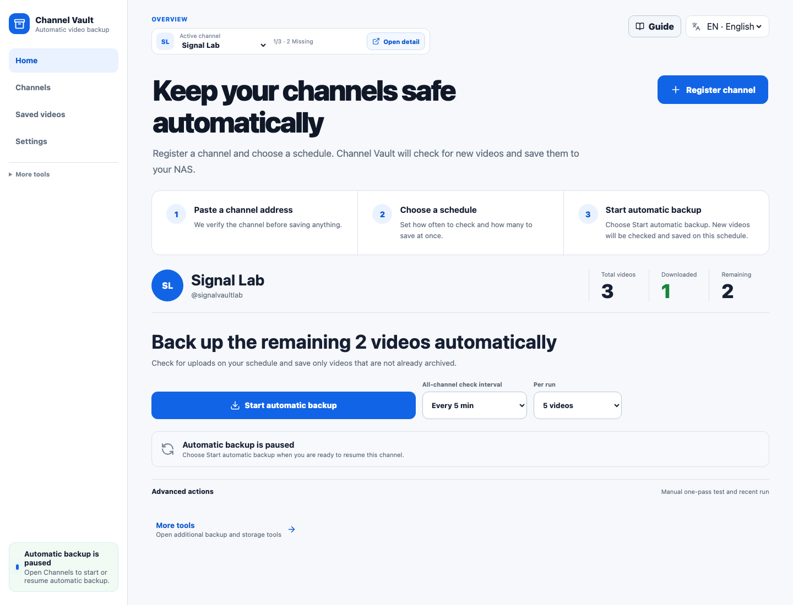

<p align="center">
  
</p>

<h1 align="center">Channel Vault NAS</h1>

<p align="center">
  <a href="README.md">English</a> · <strong>한국어</strong>
</p>

<p align="center">
  <strong>YouTube 채널을 복구 가능한 NAS 아카이브로 만드세요.</strong><br>
  채널 URL을 붙여넣으면 기존 파일과 <code>archive.txt</code>를 재사용하고,
  없는 영상만 내려받으며 새 영상도 <code>yt-dlp</code>로 계속 백업합니다.
</p>

<p align="center">
  <a href="https://github.com/hyeonsangjeon/channel-vault-nas/actions/workflows/ci.yml"></a>
  <a href="https://github.com/hyeonsangjeon/channel-vault-nas/releases"></a>
  <a href="https://hub.docker.com/r/modenaf360/channel-vault-nas-api"></a>
  <a href="LICENSE"></a>
</p>

<p align="center">
  <a href="docs/assets/user-manual/ko/01-home.png">
    
  </a>
</p>

<p align="center">
  <a href="#빠른-시작"><strong>빠른 시작</strong></a>
  &nbsp;·&nbsp;
  <a href="docs/usage/migrate-existing-archive.ko.md"><strong>기존 아카이브 가져오기</strong></a>
  &nbsp;·&nbsp;
  <a href="https://hyeonsangjeon.github.io/channel-vault-nas/ko/"><strong>한국어 매뉴얼</strong></a>
</p>

## 일반 다운로드 큐가 놓치는 부분

- **기존 아카이브를 유지합니다.** NAS에 있는 영상, 썸네일, 자막,
  `info.json` 사이드카를 다시 받지 않고 색인합니다.
- **`archive.txt`의 판단을 보여줍니다.** 다운로드됨, 없음, 대기, 건너뜀 상태가
  명령행 옵션 안에 숨지 않습니다.
- **디스크에서 복구합니다.** 미디어는 영구 데이터이고 SQLite는 다시 만들 수 있는
  검색용 색인입니다.
- **한 번 설정하고 자동으로 보관합니다.** 간격과 한 번에 받을 영상 수를 고르고,
  같은 채널 화면에서 자동 백업을 시작하거나 일시정지합니다.

7년 전 공개한
[`youtube-dl-nas`](https://github.com/hyeonsangjeon/youtube-dl-nas)의 제작자가,
일회성 URL 다운로드가 아닌 장기 채널 아카이브를 위해 새로 만들었습니다.

## 빠른 시작

저장소를 clone하거나 이미지를 직접 빌드할 필요가 없습니다.

```bash
mkdir channel-vault-nas && cd channel-vault-nas
curl -fsSLO https://raw.githubusercontent.com/hyeonsangjeon/channel-vault-nas/main/compose.release.yml
docker compose -f compose.release.yml up -d
```

구형 Synology Docker 패키지에서는 `docker compose` 대신 `docker-compose`를
사용하세요. 릴리스 파일은 Compose v2와 레거시 Compose 1.28.5에서 모두
검증했습니다.

브라우저에서 **`http://127.0.0.1:5173/`**을 연 다음:

1. **홈**에서 **채널 등록**을 누르고 URL 또는 `@handle`을 붙여넣은 뒤
   **채널 확인**을 누릅니다.
2. 확인된 채널 이름과 주소가 맞으면 **채널 등록**을 누릅니다.
3. 간격과 한 번에 받을 영상 수를 고르고 **자동 백업 시작**을 누른 뒤,
   같은 화면에서 자동 백업이 켜졌는지 확인합니다.

이미 파일이나 `archive.txt`가 있다면 자동 백업 전에 [기존 아카이브
가져오기](docs/usage/migrate-existing-archive.ko.md)를 따라 하세요. 기존 영상을
먼저 색인하므로 불필요한 재다운로드를 피할 수 있습니다.

Synology/QNAP 설치는 [한국어 NAS 설치
가이드](https://hyeonsangjeon.github.io/channel-vault-nas/ko/install/nas/)를,
확인된 환경은 [호환성 표](docs/install/compatibility.ko.md)를 참고하세요.

> 이 셀프 호스팅 릴리스는 localhost, 사설 LAN, VPN, 또는 신뢰할 수 있는 리버스
> 프록시용입니다. 공개 인터넷에 그대로 노출하지 마세요.

## 화면

| 오늘의 아카이브 상태 | 자동 백업 |
| --- | --- |
|  |  |

| 채널 등록 | 기존 아카이브 가져오기 |
| --- | --- |
|  |  |

## 현재 지원 범위

- 채널 등록과 메타데이터 동기화
- 새 영상 후보 생성과 자동 다운로드 일정
- 이미 받은 영상 건너뜀과 `archive.txt` 가져오기
- 실제 `yt-dlp` 다운로드, 재시도, 취소, 실행 기록
- 미디어·썸네일·자막·사이드카 라이브러리 색인
- NAS 저장소 스캔, 드리프트와 고아 사이드카 확인
- Docker Hub/GHCR의 `amd64`·`arm64` 이미지
- 한국어·영어 매뉴얼과 5개 UI 언어

아직 다중 사용자 계정과 지원되는 쿠키/비공개 영상 흐름은 없습니다. 저작권과
서비스 이용약관을 준수하고, 소유하거나 보관 권한이 있는 콘텐츠에 사용하세요.

## 링크

- [한국어 사용 매뉴얼](https://hyeonsangjeon.github.io/channel-vault-nas/ko/)
- [Docker Hub API 이미지](https://hub.docker.com/r/modenaf360/channel-vault-nas-api)
- [Docker Hub Web 이미지](https://hub.docker.com/r/modenaf360/channel-vault-nas-web)
- [릴리스](https://github.com/hyeonsangjeon/channel-vault-nas/releases)
- [NAS 호환성 리포트](https://github.com/hyeonsangjeon/channel-vault-nas/discussions/7)
- [비교: 나에게 맞을까요?](docs/about/comparison.ko.md)
- [MIT License](LICENSE)
