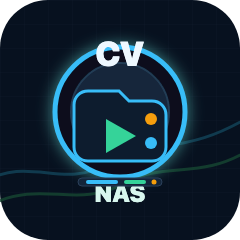
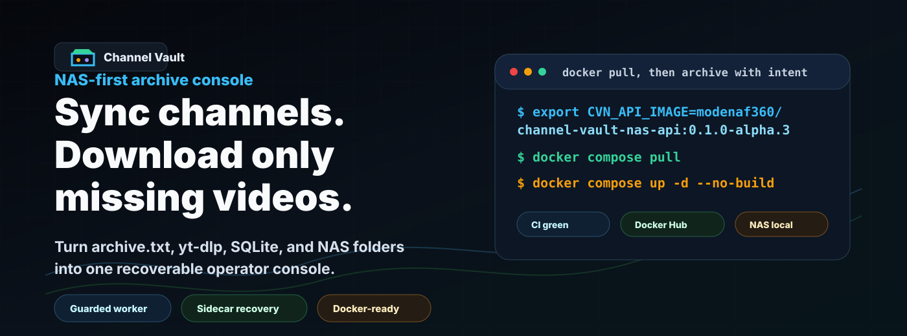
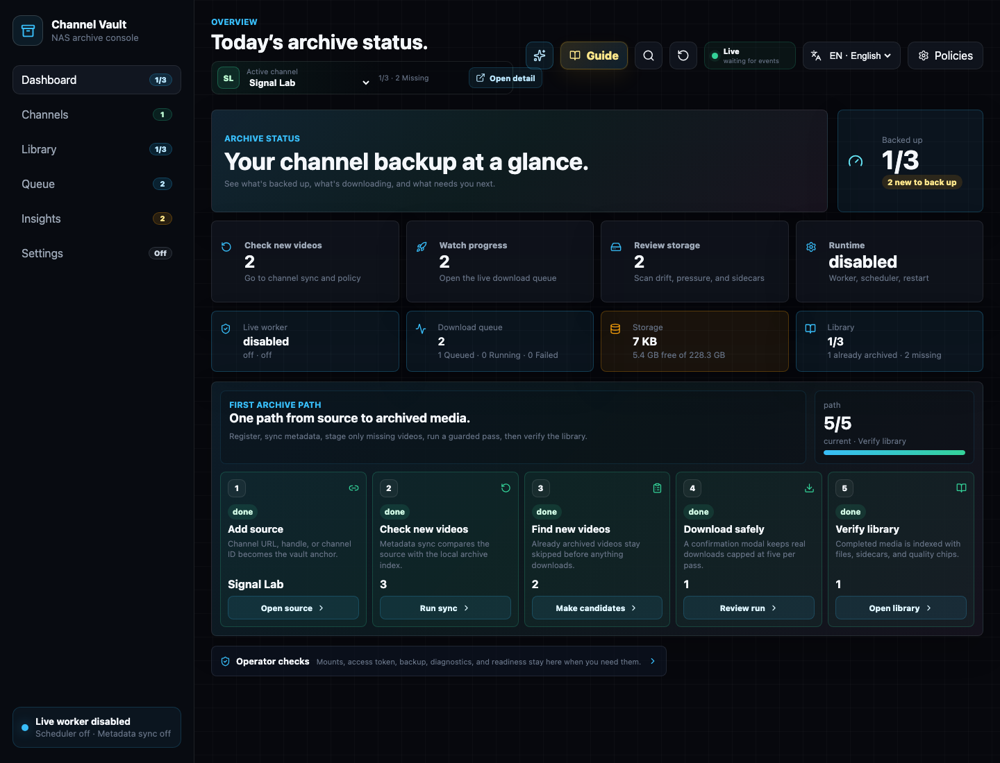
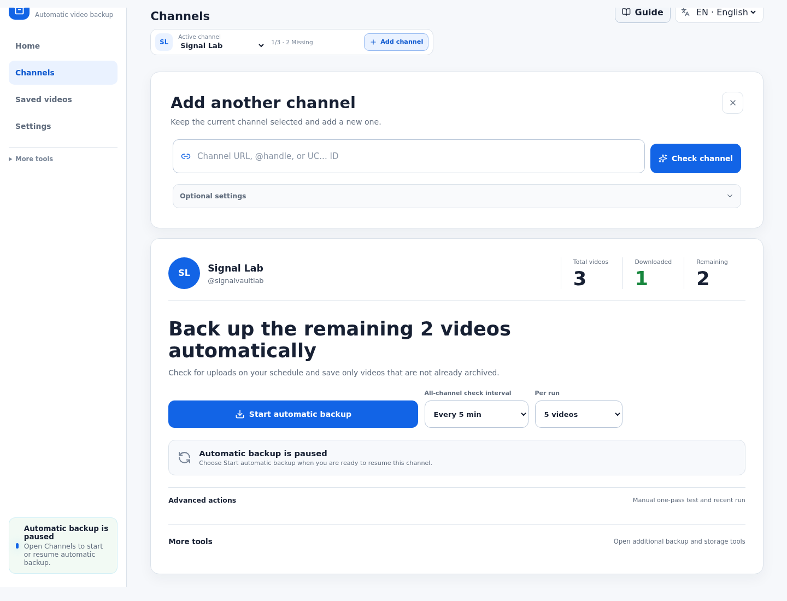
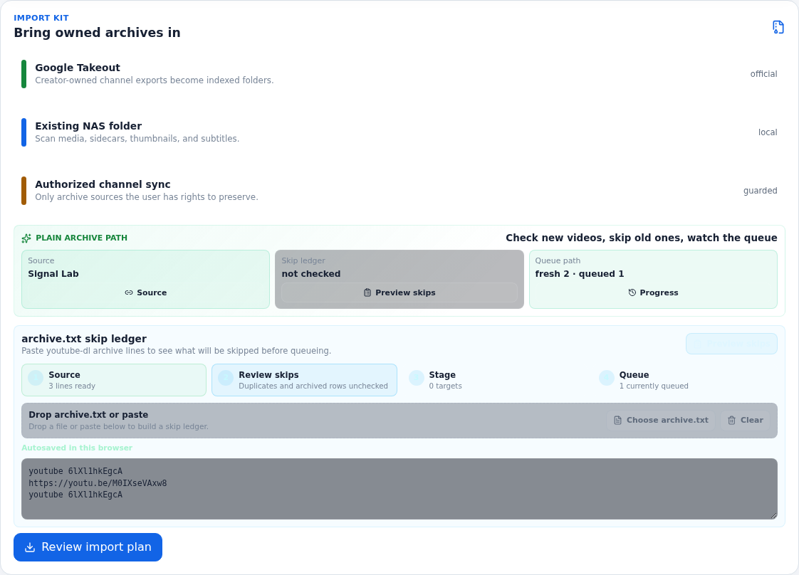
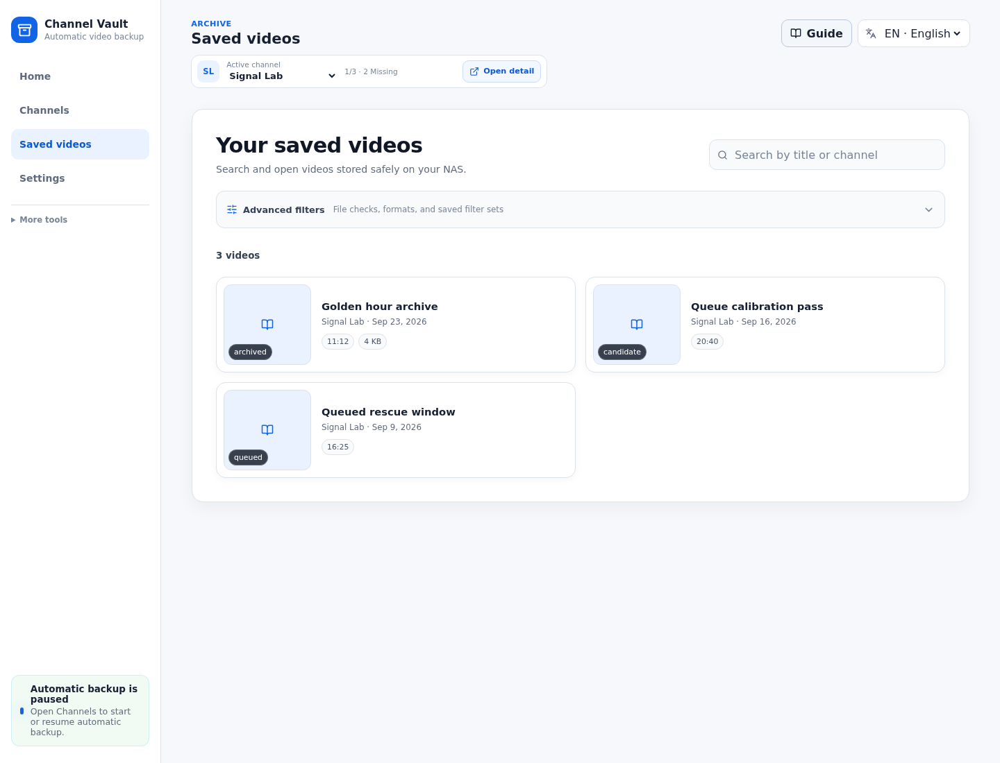
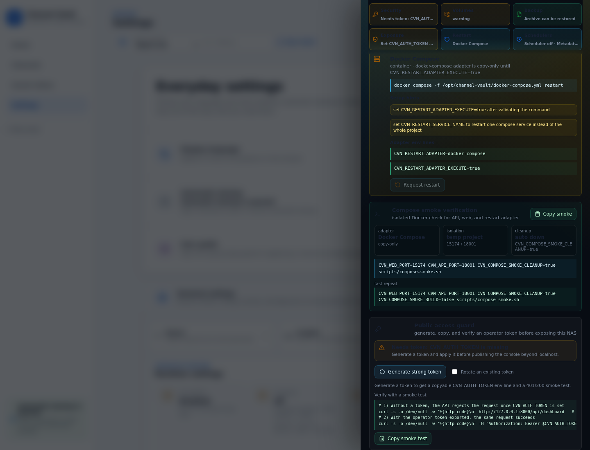

<p align="center">
  
</p>

<h1 align="center">Channel Vault NAS</h1>

<p align="center">
  <strong>English</strong> · <a href="README.ko.md">한국어</a>
</p>

<p align="center">
  <strong>Turn your YouTube channel into a recoverable NAS archive.</strong><br>
  Paste a channel URL. Channel Vault reuses what is already on disk, downloads only what is missing, and keeps new uploads backed up with <code>yt-dlp</code>.
</p>

<p align="center">
  <a href="https://github.com/hyeonsangjeon/channel-vault-nas/actions/workflows/ci.yml"></a>
  <a href="https://github.com/hyeonsangjeon/channel-vault-nas/releases"></a>
  <a href="https://hub.docker.com/r/modenaf360/channel-vault-nas-api"></a>
  <a href="LICENSE"></a>
  <a href="https://hyeonsangjeon.github.io/channel-vault-nas/"></a>
</p>

<p align="center">
  <a href="docs/assets/demo/channel-vault-public-alpha.gif">
    
  </a>
</p>

<p align="center">
  <a href="#quick-start"><strong>Quick start</strong></a>
  &nbsp;·&nbsp;
  <a href="docs/usage/migrate-existing-archive.md"><strong>Bring an existing archive</strong></a>
  &nbsp;·&nbsp;
  <a href="docs/about/comparison.md"><strong>Is it for me?</strong></a>
</p>

## The part other download queues leave out

- **Keep your current archive.** Scan existing video folders, thumbnails,
  subtitles, and `info.json` sidecars without downloading them again.
- **See what `archive.txt` knows.** Downloaded, missing, queued, and skipped
  videos are visible in the UI instead of disappearing inside a command flag.
- **Recover from disk.** Media stays the source of truth; SQLite is a searchable
  index that can be rebuilt from the NAS folders.
- **Set it once.** Choose a download interval and batch size, start automatic
  backup, and pause it from the same channel screen.

From the maker of
[`youtube-dl-nas`](https://github.com/hyeonsangjeon/youtube-dl-nas), rebuilt for
long-lived channel archives rather than one-off URL downloads.

## Quick Start

Run the published multi-architecture images. No repository clone and no local
build are required:

```bash
mkdir channel-vault-nas && cd channel-vault-nas
curl -fsSLO https://raw.githubusercontent.com/hyeonsangjeon/channel-vault-nas/main/compose.release.yml
docker compose -f compose.release.yml up -d
```

On older Synology Docker packages, use `docker-compose` in place of
`docker compose`. The release file is verified with both Compose v2 and legacy
Compose 1.28.5.

Open **`http://127.0.0.1:5173/`**, then:

1. Open **Channels**, paste a channel URL or `@handle`, and click **Preview**.
2. Confirm the channel and click **Register channel**.
3. Choose the download interval and videos per run, then click **Start automatic
   backup**.

Already have files or an `archive.txt`? Follow
[Bring an existing archive](docs/usage/migrate-existing-archive.md) first so
Channel Vault can index them and skip unnecessary downloads.

See the [compatibility matrix and real NAS report
thread](docs/install/compatibility.md) before installing on new hardware.

> Guardrail: this self-hosted release is built for localhost, private LAN, VPN, or trusted
> reverse-proxy use. Do not expose it directly to the public internet.

## How the archive survives the app

The filesystem is durable data. The database is the index and operation log.
That means a future rescan can rebuild library state from media and sidecars
instead of forcing a second download.

<p align="center">
  
</p>

## Registry Links

- Docker Hub API image:
  [`modenaf360/channel-vault-nas-api`](https://hub.docker.com/r/modenaf360/channel-vault-nas-api)
- Docker Hub web image:
  [`modenaf360/channel-vault-nas-web`](https://hub.docker.com/r/modenaf360/channel-vault-nas-web)
- GHCR mirror:
  [`ghcr.io/hyeonsangjeon/channel-vault-nas-api`](https://github.com/hyeonsangjeon/channel-vault-nas/pkgs/container/channel-vault-nas-api)
  and
  [`ghcr.io/hyeonsangjeon/channel-vault-nas-web`](https://github.com/hyeonsangjeon/channel-vault-nas/pkgs/container/channel-vault-nas-web)
- Documentation (install + usage manual, EN/KO):
  [`hyeonsangjeon.github.io/channel-vault-nas`](https://hyeonsangjeon.github.io/channel-vault-nas/)
- NAS compatibility reports:
  [`GitHub Discussions #7`](https://github.com/hyeonsangjeon/channel-vault-nas/discussions/7)

## Why It Exists

Most download tools answer one question: "Can this URL be downloaded?"

Channel Vault NAS answers the NAS operator question:

> "What changed, what is already archived, what is safe to download next, and
> can I recover the archive if the app database disappears?"

The filesystem remains the durable archive. SQLite is the index over that
archive.

## Current Status

This is an active self-hosted release. The core loop is working in Docker and
local development:

- Channel registration and source probing
- Metadata sync and automatic metadata scheduler
- Per-channel policies, including `auto_download`
- Candidate generation for missing videos
- Download queue with preflight, retry, cancel, and bounded worker passes
- Real `yt-dlp` downloads when explicitly enabled
- Worker run audit with completed/skipped/failed/slow filters, scheduler tick logs, and event drawers
- Runtime settings with `.env.runtime` apply/restart guidance
- Storage scanner for real NAS folders, drift, pressure, and orphan sidecars
- Library index with media files, sidecar fidelity, codec/profile filters, in-app preview, and portable saved views
- React/Vite UI split into Dashboard, Channels, Library, Queue, Insights, and Settings
- Safe in-app demo workspace for empty installs, without YouTube calls or downloads
- Versioned Docker Hub and GHCR images,
  with Docker Hub pull-based Compose smoke verified

Not ready yet:

- Multi-user auth/session hardening for exposed networks
- NAS-vendor-specific (Synology/QNAP) first-run install videos

The current release direction and release gate are tracked in
[`docs/roadmap.md`](docs/roadmap.md) and [`CHANGELOG.md`](CHANGELOG.md).

Do not expose the app directly to the public internet. For private LAN or
NAS access, enable the optional operator token described below and still prefer
VPN or a trusted reverse proxy.
See [`docs/deployment-security.md`](docs/deployment-security.md) for concrete
Nginx, Caddy, and Cloudflare Tunnel examples.

## Known Limitations

This is a guarded self-hosted release. Knowing the boundaries up front keeps deployments safe:

- Alpha is for localhost, private LAN, VPN, or trusted reverse-proxy use, not
  direct public internet exposure.
- Downloads depend on `yt-dlp` behavior and source availability; most failures
  reflect upstream changes rather than app state.
- There is no supported cookies/private-video workflow yet. Sources that require
  authenticated browser state may not be available.
- There is no multi-user account system yet. Access is a single shared operator
  view.
- The optional `CVN_AUTH_TOKEN` is an operator gate, not a full identity
  provider.
- Public internet exposure should sit behind SSO, VPN, or reverse-proxy policy.
- Some NAS package-manager restart hooks are guidance/copy-first unless a safe
  supervised hook is configured (`CVN_RESTART_ADAPTER_EXECUTE=true` plus a
  verified command).
- You are responsible for backing up the metadata database and archive folders;
  the app does not manage off-NAS backups.

See [`docs/roadmap.md`](docs/roadmap.md) for non-goals and
[`SECURITY.md`](SECURITY.md) for exposure and token boundaries.

For a practical fit check, see [Is Channel Vault NAS for
me?](docs/about/comparison.md).

## Preview

These screenshots are generated from the seeded browser smoke fixture, not from
static mockups.

| Dashboard overview | Channel backup schedule |
| --- | --- |
|  |  |

| Add a channel | Bring an existing archive |
| --- | --- |
|  |  |

| Queue console | Library shelf | Runtime guide |
| --- | --- | --- |
|  |  |  |

Refresh the public screenshot set:

```bash
cd frontend
CVN_CAPTURE_PUBLIC_SCREENSHOTS=true npx playwright test e2e/public-screenshots.spec.ts --project=chromium
```

Record the deterministic public demo WebM:

```bash
scripts/capture-public-demo.sh
```

The generated recording is written to
`docs/assets/demo/channel-vault-public-alpha.webm` and is ignored by git until a
reviewed final asset is ready to publish.

## Product Tour

### Dashboard

The dashboard is a three-step archive overview: add a source, start automatic
backup, and verify the library. Detailed mount, access, diagnostic, and
readiness checks stay collapsed until an operator needs them.

### Channels

The Channels tab is the start point. Registration and automatic backup are the
two primary surfaces:

1. Register a channel — paste a URL / `@handle` / `UC…` ID, click **Preview**,
   review it, then **Register channel**.
2. Review the remaining videos (Total / Downloaded / Remaining).
3. Choose interval and per-run count, then click **Start automatic backup**.
4. Bring in existing NAS folders or `archive.txt` before downloading when you
   already have an archive.

### Queue

The queue console shows all candidate, queued, running, completed, failed, and
cancelled jobs. It leads with the current Visible jobs; stale failures for
already-archived videos are hidden. Automatic passes are bounded by the
configured per-run count; the advanced manual pass keeps its confirmation step.

### Library

The library shows archived and missing videos together. It indexes sidecars,
media files, codec/profile metadata, thumbnails, subtitles, queue state, and
path integrity. Saved views make repeated NAS checks fast, and portable JSON
export/import lets operators move useful views between installs. Media detail
drawers can preview indexed files in-app through range-capable, per-file stream
endpoints. Archive counts are disk-aware across Library, Channel detail, and
Dashboard coverage, so stale DB rows show as missing media instead of pretending
the file is still on the NAS.

### Insights

Insights reads the actual archive root and reports storage pressure, folder
structure, extension totals, unindexed media, indexed-but-missing files, and
orphan sidecars.

### Settings

Settings is the runtime console: worker flags, scheduler flags, binary paths,
restart adapters, tick logs, worker summaries, and runtime audit events.

## Source Build (Advanced)

This section shows the source-build path. For the fastest no-build install, use
[Quick Start](#quick-start) or
[Run a published image](#run-a-published-image-no-build).

Both paths store archive data in bind-mounted folders.

There are three ways to run Channel Vault NAS:

- **Local development** — run the backend and frontend dev servers directly
  (see [Quickstart: Local Development](#quickstart-local-development)).
- **Compose build from source** — build images from this repo with Docker
  Compose (the steps below). Best for evaluating the current `main`/branch code.
- **Pull a published image** — run tagged images from Docker Hub or GHCR without
  building (see [Run a published image](#run-a-published-image-no-build)). Best
  for a fast, reproducible install.

```bash
git clone https://github.com/hyeonsangjeon/channel-vault-nas.git
cd channel-vault-nas
cp .env.example .env
mkdir -p metadata downfolder runtime
docker compose up --build
```

For NAS deployment, keep SQLite metadata, downloaded media, and runtime
overrides on separate host folders before the first start:

```bash
mkdir -p /volume1/channel-vault-nas/{metadata,archive,runtime}
```

```env
CVN_METADATA_HOST_DIR=/volume1/channel-vault-nas/metadata
CVN_DOWNLOAD_HOST_DIR=/volume1/channel-vault-nas/archive
CVN_RUNTIME_HOST_DIR=/volume1/channel-vault-nas/runtime
```

After startup, the dashboard `NAS Mount Doctor` strip verifies those paths are
writable and separated. The same preset is copyable from Settings -> Env guide.

For anything beyond localhost, edit `.env` first:

- set `CVN_AUTH_TOKEN` to a long random value
- when using a reverse proxy, publish only the web port and set
  `CVN_API_PORT=127.0.0.1:8000`

Open:

```text
http://127.0.0.1:5173/
```

If you see only `{"detail":"Not Found"}`, you opened the raw API port instead
of the web console. Open the `web` port (`CVN_WEB_PORT`, default `5173`) or point
your reverse proxy at the web service. The API port is only for paths such as
`/api/health`.

The compose stack runs:

- `api`: FastAPI backend with `yt-dlp`, `ffmpeg`, and `ffprobe`
- `web`: nginx-served React app
- `./metadata`: SQLite DB and startup backups
- `./downfolder`: archived media and sidecars
- `./runtime/.env.runtime`: Settings tab runtime overrides

To verify Compose without touching your working archive folders, override the
ports and host folders:

```bash
mkdir -p /tmp/channel-vault-compose/{metadata,downfolder,runtime}
CVN_WEB_PORT=15173 \
CVN_API_PORT=18000 \
CVN_METADATA_HOST_DIR=/tmp/channel-vault-compose/metadata \
CVN_DOWNLOAD_HOST_DIR=/tmp/channel-vault-compose/downfolder \
CVN_RUNTIME_HOST_DIR=/tmp/channel-vault-compose/runtime \
docker compose up -d --build
```

Then open `http://127.0.0.1:15173/` or call
`http://127.0.0.1:18000/api/health`.

The same safe verification path is available as a smoke script. It uses a
separate Compose project name by default, starts the stack, waits for API,
proxied API, and web health, checks the Runtime restart adapter, then prints the
cleanup command:

```bash
scripts/compose-smoke.sh
```

Useful overrides:

```bash
CVN_COMPOSE_SMOKE_BUILD=false scripts/compose-smoke.sh
CVN_COMPOSE_SMOKE_CLEANUP=true scripts/compose-smoke.sh
CVN_WEB_PORT=15174 CVN_API_PORT=18001 scripts/compose-smoke.sh
CVN_WEB_PORT=127.0.0.1:15174 CVN_API_PORT=127.0.0.1:18001 scripts/compose-smoke.sh
```

The smoke script checks for occupied ports before building. If your normal
Compose stack is already using the default smoke ports, pass alternate
`CVN_WEB_PORT` and `CVN_API_PORT` values as shown above.

For an already-running NAS, LAN, or reverse-proxy deployment, run the live
deployment smoke against the exposed web endpoint. When a token is provided it
verifies `/api/health`, protected `/api/dashboard` `401`/`200` behavior,
bearer and `X-CVN-Token` headers, and WebSocket upgrade through the web/proxy
path:

```bash
CVN_DEPLOYMENT_SMOKE_WEB_URL=https://vault.example.test \
CVN_DEPLOYMENT_SMOKE_AUTH_TOKEN="$CVN_AUTH_TOKEN" \
scripts/deployment-smoke.sh
```

If you also want to prove the backend API port is not exposed at a public
address, pass the address that should fail:

```bash
CVN_DEPLOYMENT_SMOKE_WEB_URL=https://vault.example.test \
CVN_DEPLOYMENT_SMOKE_AUTH_TOKEN="$CVN_AUTH_TOKEN" \
CVN_DEPLOYMENT_SMOKE_FORBIDDEN_API_URL=http://vault.example.test:8000 \
scripts/deployment-smoke.sh
```

Real downloads remain disabled until **Start automatic backup** is clicked in a
channel. The UI hot-applies the worker and scheduler settings; no container
restart is required. Operators can still set
`CVN_DOWNLOAD_WORKER_ENABLED=true` in `.env` and restart manually.

The Compose profile also sets `CVN_RESTART_ADAPTER=docker-compose` and
`CVN_RESTART_SERVICE_NAME=api` so the Settings tab can show the correct restart
command. It remains copy-only by default because the backend container does not
mount the host Docker socket or ship with a Docker CLI.

### Run a published image (no build)

The current `Release images` workflow publishes `api` and `web` images to both
Docker Hub and GitHub Container Registry (`.github/workflows/release-images.yml`,
triggered on `v*` tags or manually with `workflow_dispatch`). Docker Hub is the
most familiar pull path for NAS operators; GHCR remains the GitHub-linked
release registry.

Run the published Docker Hub images without cloning or building the repository:

```bash
mkdir channel-vault-nas && cd channel-vault-nas
curl -fsSLO https://raw.githubusercontent.com/hyeonsangjeon/channel-vault-nas/main/compose.release.yml
docker compose -f compose.release.yml up -d
```

Equivalent GHCR image overrides:

```bash
CVN_API_IMAGE=ghcr.io/hyeonsangjeon/channel-vault-nas-api:0.1.0-alpha.3
CVN_WEB_IMAGE=ghcr.io/hyeonsangjeon/channel-vault-nas-web:0.1.0-alpha.3
```

Direct `docker run` is also possible. Compose is still recommended because it
keeps ports, volumes, health checks, and restart policy in one file, but these
commands are useful for registry smoke tests.

Choose Docker Hub:

```bash
export CVN_API_IMAGE=modenaf360/channel-vault-nas-api:0.1.0-alpha.3
export CVN_WEB_IMAGE=modenaf360/channel-vault-nas-web:0.1.0-alpha.3
```

Or choose GHCR:

```bash
export CVN_API_IMAGE=ghcr.io/hyeonsangjeon/channel-vault-nas-api:0.1.0-alpha.3
export CVN_WEB_IMAGE=ghcr.io/hyeonsangjeon/channel-vault-nas-web:0.1.0-alpha.3
```

Then run both containers on one Docker network. The `api` network alias is
required because the web image proxies `/api` and `/ws` to `http://api:8000`.

```bash
mkdir -p metadata downfolder runtime
docker network create channel-vault-nas 2>/dev/null || true

docker run -d \
  --name channel-vault-nas-api \
  --network channel-vault-nas \
  --network-alias api \
  -p 8000:8000 \
  -e CVN_DATABASE_URL='sqlite+aiosqlite:///./metadata/app.db' \
  -e CVN_METADATA_DIR='./metadata' \
  -e CVN_DOWNLOAD_DIR='./downfolder' \
  -e CVN_RUNTIME_ENV_FILE='/app/runtime/.env.runtime' \
  -e CVN_DB_MIGRATE_ON_STARTUP=true \
  -v "$PWD/metadata:/app/metadata" \
  -v "$PWD/downfolder:/app/downfolder" \
  -v "$PWD/runtime:/app/runtime" \
  "$CVN_API_IMAGE"

docker run -d \
  --name channel-vault-nas-web \
  --network channel-vault-nas \
  -p 5173:80 \
  "$CVN_WEB_IMAGE"
```

Open `http://127.0.0.1:5173/`. Cleanup:

```bash
docker rm -f channel-vault-nas-web channel-vault-nas-api
docker network rm channel-vault-nas
```

Notes:

- Docker Hub packages are published under `modenaf360/channel-vault-nas-api`
  and `modenaf360/channel-vault-nas-web`.
- Publishing to Docker Hub requires repository Actions secrets:
  `DOCKERHUB_USERNAME=modenaf360` and `DOCKERHUB_TOKEN=<Docker Hub access token>`.
- GHCR packages are private by default. If anonymous `docker compose pull`
  returns a permission error, the maintainer still needs to set both packages to
  Public and link them to this repo. Until then, run `docker login ghcr.io` with
  a token that can read the packages.
- `manifest unknown` means the requested tag has not been published. Use a
  listed release tag or build from source.
- Set `CVN_API_IMAGE` and `CVN_WEB_IMAGE` together. If only one is set, Compose
  tries to pull the other from its default local tag and the pull fails.
- `docker-compose.yml` defaults to local build tags
  (`channel-vault-nas-api:local` / `channel-vault-nas-web:local`), so unset both
  overrides to go back to building from source.

The same `CVN_METADATA_HOST_DIR`, `CVN_DOWNLOAD_HOST_DIR`, and
`CVN_RUNTIME_HOST_DIR` volume separation and `CVN_AUTH_TOKEN` guidance above
apply to published images too; the NAS Mount Doctor strip still verifies the
mounted host folders.

### Optional Local Access Token

For LAN/NAS demos, set an operator token before starting the stack:

```env
CVN_AUTH_TOKEN=replace-with-a-long-random-token
```

You can also generate, copy, and verify a token without leaving the app: open
**Settings -> Env guide -> Public access guard**. It creates a strong token in
your browser, copies the `CVN_AUTH_TOKEN=...` line for `.env.runtime`, and copies
a 401/200 smoke-test command. The token is generated locally and is never sent to
the backend, logged, or included in support bundles.

When enabled, every API route except `/api/health` requires the token. The UI
shows an access gate and stores the token only in the current browser. API
clients can send either:

```bash
curl -H "Authorization: Bearer $CVN_AUTH_TOKEN" http://127.0.0.1:8000/api/dashboard
```

or:

```bash
curl -H "X-CVN-Token: $CVN_AUTH_TOKEN" http://127.0.0.1:8000/api/dashboard
```

This is a local operator guardrail, not full production internet auth. Use a
VPN, trusted reverse proxy, and network-level access control for anything
outside your private network.

Deployment examples for private LAN or tunnel access are in
[`docs/deployment-security.md`](docs/deployment-security.md).

### First Backup And Safe Demo

On **Channels**, paste a URL, `@handle`, or `UC...` ID, click **Preview**, then
**Register channel**. The channel screen shows Total / Downloaded / Remaining
once. Pick the download interval and videos per run, then click **Start automatic
backup**. The button enables the worker, metadata sync, and scheduler together.
**Save schedule** applies later changes and **Pause** stops future passes. An
advanced manual test remains available for one bounded pass. A fully archived
channel is a completed state, not a failure.

The secondary safe demo workspace action seeds a deterministic `Signal Lab`
channel, one archived media item, missing-video candidates, queue history,
scheduler ticks, library sidecars, storage drift, and orphan sidecars.

The demo path does not call YouTube and does not start downloads. It is intended
for first impressions, screenshots, public walkthroughs, and contributor
orientation. If the workspace already has real registered channels, the backend
refuses to seed the demo so existing archives are not mixed with fixture data.
The clean-install gate says this plainly before seeding. Once loaded, the
channel detail view shows a demo banner and a clear action that removes only the
`Signal Lab` demo channel and its demo archive folder.

## Quickstart: Local Development

Prerequisites:

- Python 3.11+
- Node.js 20+ for local development; CI currently verifies with Node.js 24
- `yt-dlp`
- `ffmpeg` / `ffprobe`

Backend:

```bash
cd backend
python3 -m venv .venv
source .venv/bin/activate
pip install -e ".[dev]"
CVN_DB_MIGRATE_ON_STARTUP=true uvicorn app.main:app --host 127.0.0.1 --port 8000
```

Frontend:

```bash
cd frontend
npm install
VITE_API_BASE_URL=http://127.0.0.1:8000 npm run dev -- --host 127.0.0.1 --port 5173
```

Open:

```text
http://127.0.0.1:5173/
```

Health check:

```bash
curl http://127.0.0.1:8000/api/health
```

## Enable Real Downloads

The app is safe by default. It can plan and queue jobs without starting media
transfer. Real downloads require the worker flag.

For local development:

```bash
CVN_DOWNLOAD_WORKER_ENABLED=true
CVN_YTDLP_BINARY=yt-dlp
CVN_FFPROBE_BINARY=ffprobe
```

Restart the backend after changing runtime env. The Settings tab can persist
non-secret runtime overrides into `.env.runtime` and shows whether a restart is
still required.

Worker passes are intentionally bounded:

- Starting automatic backup enables real downloads; each pass claims only the
  configured **Per run** batch size (5 by default).
- The advanced Manual one-pass test runs up to that same batch size once, behind
  a confirmation modal.
- API `run-once` limits are capped.
- Per-channel policy can pause worker claims.
- Candidate creation can continue even when workers are paused.

## Demo And Release Verification Flow

1. Start with Docker Compose or the local development commands above.
2. Open Dashboard and confirm the release readiness card, live event pill, and clean-install gate.
3. Go to the Channels tab, paste a channel URL, `@handle`, or `UC...` channel ID, and click **Preview** to inspect the source before anything is registered.
4. Review the channel name, video count, estimated size, save folder, first preview videos, and safety notes, then click **Register channel**.
5. Open the channel, review Total / Downloaded / Remaining, select interval and per-run count, then click **Start automatic backup**.
6. Real downloads run only after automatic backup starts (or you confirm the advanced manual test).
7. For a no-network walkthrough, expand the secondary safe demo panel and load `Signal Lab` without external calls.
8. Open Queue to watch the current Visible jobs — progress, failures, retries, and worker audit detail (stale failures for already-archived videos are hidden).
9. Open Library and confirm completed media/index coverage changed.
10. Open Insights to inspect storage pressure, drift, and orphan sidecars.
11. Open Settings to inspect runtime flags, scheduler ticks, restart guidance, backup confidence, and support exports.
12. Return to Dashboard and copy or download the onboarding proof JSON for a redacted readiness snapshot.

Dashboard support export buttons request a server-generated redacted diagnostic
bundle first, then fall back to the browser snapshot if the server endpoint is
not available. The server bundle removes operator tokens, absolute paths,
source URLs, channel/video titles, and generated download commands.
The onboarding proof export is separate: it summarizes readiness, runtime,
mount, queue, library, storage, and backup posture from the UI state while
excluding titles, source URLs, absolute paths, generated commands, and tokens.

The `archive.txt` path supports the classic workflow:

```bash
youtube-dl --download-archive archive.txt "https://www.youtube.com/playlist?list=..."
```

In Channel Vault NAS, that ledger becomes an app workflow:

- Paste or drop `archive.txt`.
- Preview already archived, known missing, unknown, duplicate, and invalid rows.
- Stage only videos that still need records/candidates.
- Sync metadata for placeholder rows.
- Queue/download only fresh candidates.

## Filesystem Contract

The default archive layout is per-video folders under the configured download
root:

```text
downfolder/
  channels/
    @handle [UC...channel_id]/
      2026/
        2026-06-03 - Video title [video_id]/
          video.mp4
          video.info.json
          *.jpg / *.webp
          *.vtt / *.srt
```

Design principles:

- `video.info.json` sidecars live beside media.
- The database indexes the filesystem, not the other way around.
- Source title changes do not rename existing folders automatically.
- Source deletion/private/block events never delete local media by default.
- Existing NAS folders can be rescanned and indexed without moving files.

## Runtime Flags

Common local flags:

```bash
CVN_DOWNLOAD_DIR=./downfolder
CVN_DATABASE_URL=sqlite+aiosqlite:///./metadata/app.db
CVN_DB_MIGRATE_ON_STARTUP=true
CVN_DOWNLOAD_WORKER_ENABLED=false
CVN_DOWNLOAD_WORKER_SCHEDULER_ENABLED=false
CVN_DOWNLOAD_WORKER_SCHEDULER_INTERVAL_SECONDS=300
CVN_DOWNLOAD_WORKER_SCHEDULER_LIMIT=5
CVN_METADATA_SYNC_SCHEDULER_ENABLED=false
CVN_METADATA_SYNC_SCHEDULER_INTERVAL_SECONDS=900
CVN_METADATA_SYNC_SCHEDULER_LIMIT=2
CVN_YTDLP_BINARY=yt-dlp
CVN_FFPROBE_BINARY=ffprobe
```

Restart adapter flags are documented in the Settings tab. Supported adapter
families in the backend are manual/local dev, Docker Compose guidance, systemd,
supervisor, Synology package, QNAP package, and an explicit supervised restart
hook.

## Tests

Backend:

```bash
cd backend
source .venv/bin/activate
pytest
```

Frontend build:

```bash
cd frontend
npm run build
```

Browser smoke:

```bash
cd frontend
npm run e2e:smoke
```

The smoke suite starts an isolated FastAPI backend, Vite frontend, temporary
SQLite DB, and temporary NAS fixture, then verifies registration, queue actions,
library views, runtime/tick surfaces, storage scan panels, worker controls, and
rescan flows on desktop and mobile.

Protected access smoke:

```bash
cd frontend
CVN_E2E_AUTH_TOKEN=cvn-local-test-token npm run e2e:auth -- --project=chromium
```

This starts the same isolated stack with `CVN_AUTH_TOKEN` enabled, verifies that
unauthenticated API calls return `401`, verifies bearer and `X-CVN-Token`
requests, and confirms the browser access gate unlocks the console.

Public release gate:

```bash
scripts/public-alpha-check.sh
```

This runs backend lint/tests, locale key consistency, frontend build, Chromium
browser smoke, protected access smoke, and `git diff --check`. Set
`CVN_PUBLIC_ALPHA_SKIP_BROWSER=true` when you only need the fast non-browser
checks.

Public screenshot refresh:

```bash
cd frontend
CVN_CAPTURE_PUBLIC_SCREENSHOTS=true npx playwright test e2e/public-screenshots.spec.ts --project=chromium
```

Public demo recording:

```bash
scripts/capture-public-demo.sh
```

For guided, screen-by-screen operator walkthroughs, open the rendered
[usage manual](https://hyeonsangjeon.github.io/channel-vault-nas/usage/)
([한국어](https://hyeonsangjeon.github.io/channel-vault-nas/ko/usage/)).
GitHub Pages builds the MkDocs documentation site from `docs/` and `mkdocs.yml`
through the `Docs Pages` workflow.

## Documentation

- [Documentation site](https://hyeonsangjeon.github.io/channel-vault-nas/)
- [Install guide](https://hyeonsangjeon.github.io/channel-vault-nas/install/) ([한국어](https://hyeonsangjeon.github.io/channel-vault-nas/ko/install/))
- [Usage manual](https://hyeonsangjeon.github.io/channel-vault-nas/usage/) ([한국어](https://hyeonsangjeon.github.io/channel-vault-nas/ko/usage/))
- [Product Brief (EN)](docs/product-brief.en.md)
- [Product Brief (KO)](docs/product-brief.md)
- [Architecture](docs/architecture.md)
- [Design Direction](docs/design-direction.md)
- [Release Roadmap](docs/roadmap.md)
- [Changelog](CHANGELOG.md)
- [Public Demo Runbook](docs/public-alpha-demo.md)
- [Docker Hub Description Source](docs/dockerhub-description.md)
- [NAS Install Guide (Synology/QNAP)](docs/nas-install.md)
- [Deployment Security](docs/deployment-security.md)
- [Backup &amp; Restore](docs/backup-restore.md)
- [Deployment examples (systemd/supervisor)](deploy/README.md)
- [Archive Priorities](docs/archive-priorities.md)
- [Storage Recovery](docs/storage-recovery.md)
- [Use Boundaries](docs/use-boundaries.md)
- [Contributing](CONTRIBUTING.md)
- [Security Policy](SECURITY.md)
- [License](LICENSE)

## Public Release Checklist

The goal is a public repo that can earn real adoption, not just a working local
prototype.

For each guarded public release:

- Run `scripts/public-alpha-check.sh`.
- Validate Docker Compose on macOS, Linux, and one NAS-like host.
- Publish versioned container images and verify Docker Hub anonymous pulls.
- Verify GHCR anonymous pulls after the GitHub packages are set Public.
- Keep README screenshot assets current from the Playwright seeded fixture.
- Record/share a short demo video or GIF with `scripts/capture-public-demo.sh`.
- Keep the safe first-run demo and runtime error copy polished.
- Run full backend, frontend build, and browser smoke tests.
- Tag a reviewed prerelease, such as `v0.1.0-alpha.3`.

## Relationship To youtube-dl-nas

This repository is a new product line. It is not a drop-in replacement for
`youtube-dl-nas` v1 and does not take over the existing
`modenaf360/youtube-dl-nas:latest` Docker image.

The new app reuses proven platform patterns from
[`hyeonsangjeon/youtube-dl-nas`](https://github.com/hyeonsangjeon/youtube-dl-nas)
but changes the product model from a URL download queue to a channel archive
console.
