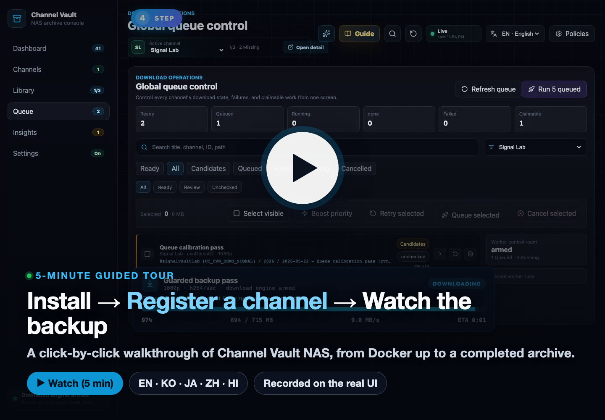

# Channel Vault NAS

**_내_ 유튜브 채널을 NAS에 아카이브하는 셀프 호스팅 콘솔입니다.**
`yt-dlp`로 계획하고, 검증하고, 내려받습니다. 파일시스템을 영구 아카이브로 두고
SQLite를 그 위의 색인으로 사용합니다.

[60초 만에 설치 :material-rocket-launch:](install/index.md){ .md-button .md-button--primary }
[사용 매뉴얼 열기 :material-book-open-variant:](usage/index.md){ .md-button }

---

## 5분 가이드 영상 보기 { #watch-the-5-minute-guide }

Docker 설치부터 채널 백업 완료까지, 실제 UI를 화면 위 단계 표시와 함께 그대로
녹화한 클릭 단위 스크린캐스트입니다.

**▶ 보기 / 내려받기:**
[English](https://github.com/hyeonsangjeon/channel-vault-nas/releases/download/v0.1.0-alpha.1/channel-vault-nas-guide-en.mp4) ·
[한국어](https://github.com/hyeonsangjeon/channel-vault-nas/releases/download/v0.1.0-alpha.1/channel-vault-nas-guide-ko.mp4) ·
[日本語](https://github.com/hyeonsangjeon/channel-vault-nas/releases/download/v0.1.0-alpha.1/channel-vault-nas-guide-ja.mp4) ·
[中文](https://github.com/hyeonsangjeon/channel-vault-nas/releases/download/v0.1.0-alpha.1/channel-vault-nas-guide-zh.mp4) ·
[हिन्दी](https://github.com/hyeonsangjeon/channel-vault-nas/releases/download/v0.1.0-alpha.1/channel-vault-nas-guide-hi.mp4)

---

## 무엇을 얻나요

-   :material-clock-fast:{ .lg .middle } __60초 만에 설치__

    ---

    공개된 Docker 이미지를 받아 Compose 스택으로 실행합니다. 빌드 단계도,
    별도 도구 체인도 없이 Docker만 있으면 됩니다.

    [:octicons-arrow-right-24: 설치 가이드](install/index.md)

-   :material-television-guide:{ .lg .middle } __안내식 첫 백업__

    ---

    채널 URL, `@handle`, `UC…` ID를 붙여넣고 분석한 뒤 계획을 검토하고,
    한 번에 최대 5개로 제한된 가드형 백업 패스를 시작합니다.

    [:octicons-arrow-right-24: 사용 매뉴얼](usage/index.md)

-   :material-nas:{ .lg .middle } __NAS를 위한 설계__

    ---

    메타데이터·미디어·런타임 오버라이드를 각각 다른 호스트 폴더로 분리합니다.
    Synology, QNAP, 베어메탈 레시피와 리버스 프록시 가이드를 제공합니다.

    [:octicons-arrow-right-24: NAS 설치](install/nas.md)

-   :material-shield-check:{ .lg .middle } __기본은 안전__

    ---

    실제 다운로드는 워커 플래그를 켜고 패스를 확인하기 전까지 꺼져 있습니다.
    파일시스템은 결코 파괴적으로 다시 쓰이지 않습니다.

    [:octicons-arrow-right-24: 다운로드 켜기](usage/enable-downloads.md)

---

## 왜 필요한가요

대부분의 다운로드 도구는 한 가지 질문에만 답합니다. *"이 URL을 받을 수 있나?"*

Channel Vault NAS는 NAS 운영자의 질문에 답합니다.

> "무엇이 바뀌었고, 무엇이 이미 아카이브됐고, 다음에 안전하게 받을 것은
> 무엇이며, 앱 데이터베이스가 사라져도 아카이브를 복구할 수 있는가?"

파일시스템이 영구 아카이브로 남고 SQLite는 그 위의 색인입니다. 기존 NAS 폴더를
다시 스캔하면 파일을 하나도 옮기지 않고 색인됩니다.

!!! warning "셀프 호스팅 가드레일"
    이 알파는 localhost, 사설 LAN, VPN, 또는 신뢰할 수 있는 리버스 프록시를
    위해 만들어졌습니다. 공개 인터넷에 직접 노출하지 **마세요**.
    [액세스 토큰](install/access-token.md)과
    [NAS 설치 가이드](install/nas.md)를 참고하세요.

---

## 레지스트리 & 링크

- Docker Hub API 이미지: [`modenaf360/channel-vault-nas-api`](https://hub.docker.com/r/modenaf360/channel-vault-nas-api)
- Docker Hub 웹 이미지: [`modenaf360/channel-vault-nas-web`](https://hub.docker.com/r/modenaf360/channel-vault-nas-web)
- GHCR 미러: [`ghcr.io/hyeonsangjeon/channel-vault-nas-api`](https://github.com/hyeonsangjeon/channel-vault-nas/pkgs/container/channel-vault-nas-api)
- 소스: [`github.com/hyeonsangjeon/channel-vault-nas`](https://github.com/hyeonsangjeon/channel-vault-nas)
