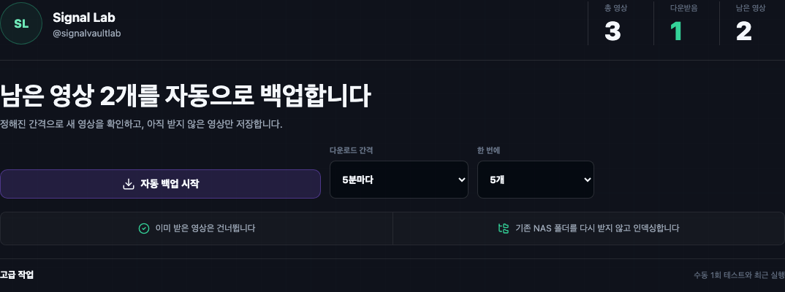

# 실제 다운로드 켜기

Channel Vault NAS는 미디어를 전송하지 않고도 등록과 미리보기를 할 수 있습니다.
**자동 백업 시작**을 누를 때 앱이 워커를 켭니다.

## 워커 켜기

가장 간단한 방법은 UI입니다. 채널을 열고 다운로드 간격과 한 번에 받을 개수를 고른
다음 **자동 백업 시작**을 누릅니다. 실제 다운로드, 메타데이터 동기화, 스케줄러가
즉시 켜집니다([채널 백업 시작 → 4단계](first-backup.md#step-4-start-the-automatic-download-schedule)
참고). 대신 NAS 전체에 직접 값을 지정하려면 다음 런타임 env를 설정하세요:

```bash
CVN_DOWNLOAD_WORKER_ENABLED=true
CVN_YTDLP_BINARY=yt-dlp
CVN_FFPROBE_BINARY=ffprobe
```

채널 버튼과 **설정** 탭은 이 워커/스케줄러 값을 즉시 적용하므로 컨테이너 재시작이
필요하지 않습니다. `.env`를 직접 편집한 경우에만 재시작하세요.

=== "Docker / Compose"

    `.env`(또는 `.env.runtime`)에 값을 추가하고 `api` 서비스를 재시작하세요:

    ```bash
    docker compose -f compose.release.yml restart api
    ```

=== "로컬 개발"

    플래그를 export하고 uvicorn을 재시작하세요:

    ```bash
    CVN_DOWNLOAD_WORKER_ENABLED=true \
    CVN_DB_MIGRATE_ON_STARTUP=true \
    uvicorn app.main:app --host 127.0.0.1 --port 8000
    ```

!!! tip "UI에서 하기"
    **설정 → Runtime env manifest**를 여세요. 현재 적용값과 저장 대기값을
    보여줍니다. [설정 둘러보기](product-tour.md#settings) 참고.

## 패스는 항상 제한됩니다

워커 패스는 실수로 클릭해도 NAS나 네트워크를 포화시키지 못하도록 의도적으로
제한됩니다:

- **자동 백업**은 실행할 때마다 **한 번에 받을 개수**만큼만 가져옵니다
  — 채널 전체를 한꺼번에 받지 않습니다.
- 고급 **수동 1회 테스트**는 같은 개수만큼 **한 번** 실행하며, 확인 모달을 거칩니다.
- API `run-once` 한도가 제한됩니다.
- 채널별 정책으로 워커 claim을 **일시정지**할 수 있습니다.
- 워커가 일시정지돼 있어도 후보 생성은 **계속**될 수 있습니다.

<figure markdown="span">
  { loading=lazy }
  <figcaption>스케줄을 시작하면 실제 다운로드가 켜지고, 각 패스는 설정한 개수만큼만 가져옵니다. 고급 수동 1회 테스트도 같은 확인 모달을 거칩니다.</figcaption>
</figure>

!!! warning "노출 전에 검증하세요"
    다운로드를 켜는 것이 NAS를 노출하지는 않습니다. 원시 API는 loopback에 묶어
    두고, [액세스 토큰](../install/access-token.md)을 설정하고, 신뢰할 수 있는
    리버스 프록시나 VPN을 통해 웹 계층만 공개하세요.
