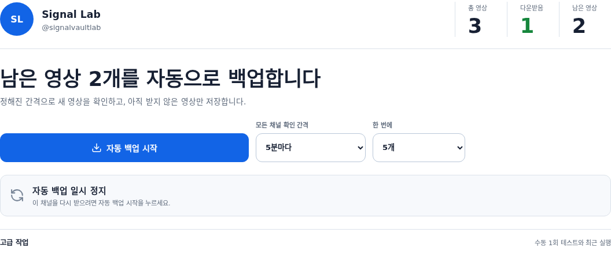

# 실제 다운로드 켜기

Channel Vault NAS는 미디어를 전송하지 않고도 채널을 확인하고 등록할 수 있습니다.
**자동 백업 시작**을 누를 때 앱이 워커를 켭니다.

## 워커 켜기

가장 간단한 방법은 UI입니다. 채널을 열고 **모든 채널 확인 간격**과 **한 번에** 받을
개수를 고른 다음 **자동 백업 시작**을 누릅니다. 실제 다운로드, 메타데이터 동기화,
스케줄러가 즉시 켜집니다([채널 백업 시작 → 2단계](first-backup.md#start-automatic-backup)
참고). 대신 NAS 전체에 직접 값을 지정하려면 다음 런타임 env를 설정하세요:

```bash
CVN_DOWNLOAD_WORKER_ENABLED=true
CVN_YTDLP_BINARY=yt-dlp
CVN_FFPROBE_BINARY=ffprobe
```

채널 버튼과 **설정** 탭은 이 워커/스케줄러 값을 즉시 적용하므로 컨테이너 재시작이
필요하지 않습니다. Compose의 `.env` 값을 직접 편집한 경우에는 API 컨테이너를
재생성하세요.

=== "Docker / Compose"

    `.env`에 값을 추가하고 `api` 서비스를 재생성해 변경한 환경변수를 적용하세요.
    호스트에 마운트한 아카이브 데이터는 유지됩니다:

    ```bash
    docker compose -f compose.release.yml up -d --force-recreate api
    ```

=== "로컬 개발"

    플래그를 export하고 uvicorn을 재시작하세요:

    ```bash
    CVN_DOWNLOAD_WORKER_ENABLED=true \
    CVN_DB_MIGRATE_ON_STARTUP=true \
    uvicorn app.main:app --host 127.0.0.1 --port 8000
    ```

!!! tip "UI에서 하기"
    **설정 → 기술 설정 → 런타임 도구 → Env 가이드**를 여세요. 열린
    **런타임 env 매니페스트**에서 현재 적용값과 저장 대기값을 확인할 수
    있습니다. [설정 둘러보기](product-tour.md#settings) 참고.

## 다운로드와 복구 검증

API 빌드에는 Deno와 EJS 패키지를 포함한 `yt-dlp[default]`가 들어갑니다.
**설정 → 기술 설정**에서 누락된 항목을 확인할 수 있습니다. 상태 확인이나
채널 미리보기 성공만으로 실제 다운로드를 검증한 것은 아닙니다.

검증 스크립트가 포함된 이미지는 마운트와 외부 네트워크 없이 확인할 수 있습니다.
`YOUR_API_IMAGE`를 검증할 정확한 이미지 태그나 digest로 바꾸세요.

```bash
docker run --rm --network none YOUR_API_IMAGE python scripts/verify_download_recovery.py
```

직접 생성한 1초 영상을 실제 `yt-dlp`로 전송하고 `ffprobe`로 읽은 뒤, 새 SQLite
DB에 색인을 재구축합니다. DB 백업과 복구 전후 파일 해시도 확인합니다. 모든
데이터는 임시 폴더에만 남습니다. **이 검사는 YouTube 다운로드 검증이 아닙니다.**

YouTube는 별도로 확인합니다. 소유하거나 보관 권한이 있는 30초 이하 영상의 ID를
넣으세요. 라이브 영상은 제외하며 전송 크기는 50 MiB로 제한합니다.

```bash
docker run --rm YOUR_API_IMAGE python scripts/verify_download_recovery.py \
  --youtube-video-id YOUR_VIDEO_ID --allow-network
```

성공 결과의 `youtube_verified: true`는 그 시점의 해당 영상만 검증합니다. 다른
채널·지역·인증이 필요한 소스나 향후 YouTube 동작까지 보장하지 않습니다. 기존
`0.3.1` 이미지는 이 검증 스크립트가 추가되기 전에 배포됐습니다.

## 패스는 항상 제한됩니다

워커 패스는 실수로 클릭해도 NAS나 네트워크를 포화시키지 못하도록 의도적으로
제한됩니다:

- **자동 백업**은 실행할 때마다 **한 번에 받을 개수**만큼만 가져옵니다
  — 채널 전체를 한꺼번에 받지 않습니다.
- 고급 **수동 1회 테스트**는 같은 개수만큼 **한 번** 실행하며, 확인 모달을 거칩니다.
- 비동기 `worker/start`와 기존 `run-once` API 모두 실행 한도가 제한됩니다.
- 채널별 정책으로 워커 claim을 **일시정지**할 수 있습니다.
- 채널을 일시정지해도 새 영상은 찾아서 대기 목록에 넣을 수 있습니다. 다시 시작하기
  전에는 다운로드하지 않습니다.

<figure markdown="span">
  { loading=lazy }
  <figcaption>확인 간격과 한 번에 받을 개수를 고른 뒤 자동 백업 시작을 누릅니다. 각 예약 실행은 설정한 개수만큼만 가져옵니다.</figcaption>
</figure>

## 중단된 다운로드

메타데이터 DB 하나에는 API 프로세스·복제본 하나만 실행하세요. 종료할 때 워커는
다운로더 프로세스 그룹을 중단합니다. 재시작하면 실행 중으로 남아 있던 작업과 실행
기록이 실패로 바뀝니다. 큐에서 원인을 확인하고 명시적으로 재시도하세요. 부분 파일은
유지되며 `yt-dlp`가 이어받기를 시도합니다. 브라우저를 닫는 것만으로는 API가 이미
접수한 수동 실행이 취소되지 않습니다.

!!! warning "노출 전에 검증하세요"
    다운로드를 켜는 것이 NAS를 노출하지는 않습니다. 원시 API는 loopback에 묶어
    두고, [액세스 토큰](../install/access-token.md)을 설정하고, 신뢰할 수 있는
    리버스 프록시나 VPN을 통해 웹 계층만 공개하세요.
