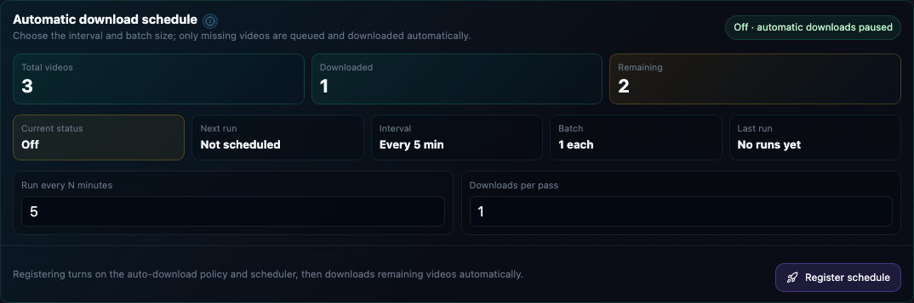

# Enable real downloads

Channel Vault NAS is **safe by default**. It can register, preview, and plan
without starting any media transfer. Real downloads require the worker flag — and
the app arms it for you the moment you **register the automatic download schedule**.

## Turn on the worker

The simplest path is the UI: opening a channel and clicking **Register schedule**
turns on real downloads and the scheduler automatically (see
[First backup → Step 4](first-backup.md#step-4-start-the-automatic-download-schedule)).
To arm the NAS globally instead, set these runtime env values:

```bash
CVN_DOWNLOAD_WORKER_ENABLED=true
CVN_YTDLP_BINARY=yt-dlp
CVN_FFPROBE_BINARY=ffprobe
```

Then **restart the backend**. The **Settings** tab can persist non-secret runtime
overrides into `.env.runtime` and shows whether a restart is still required.

=== "Docker / Compose"

    Add the values to `.env` (or `.env.runtime`) and restart the `api` service:

    ```bash
    docker compose restart api
    ```

=== "Local development"

    Export the flag and restart uvicorn:

    ```bash
    CVN_DOWNLOAD_WORKER_ENABLED=true \
    CVN_DB_MIGRATE_ON_STARTUP=true \
    uvicorn app.main:app --host 127.0.0.1 --port 8000
    ```

!!! tip "Do it from the UI"
    Open **Settings → Runtime env manifest**. It shows the exact env lines to arm
    the NAS, a **Copy manifest** button, and — if a restart adapter is configured
    — a **Request restart** action. See the
    [Settings tour](product-tour.md#settings).

## The pass is always bounded

Worker passes are intentionally capped so an accidental click can't saturate your
NAS or your network:

- The **automatic download schedule** claims only your **Downloads per pass**
  batch size each time it runs — never the whole channel at once.
- The advanced **Manual one-pass test** runs up to that same batch size **once**,
  behind a confirmation modal.
- API `run-once` limits are capped.
- Per-channel policy can **pause** worker claims.
- Candidate creation can continue **even when workers are paused**.

<figure markdown="span">
  { loading=lazy }
  <figcaption>Starting the schedule enables real downloads; each pass claims only the configured batch size. The advanced Manual one-pass test is gated by the same confirmation modal.</figcaption>
</figure>

!!! warning "Verify before you expose"
    Enabling downloads does not expose your NAS. Keep the raw API loopback-bound,
    set an [access token](../install/access-token.md), and publish only the web
    tier through a trusted reverse proxy or VPN.
