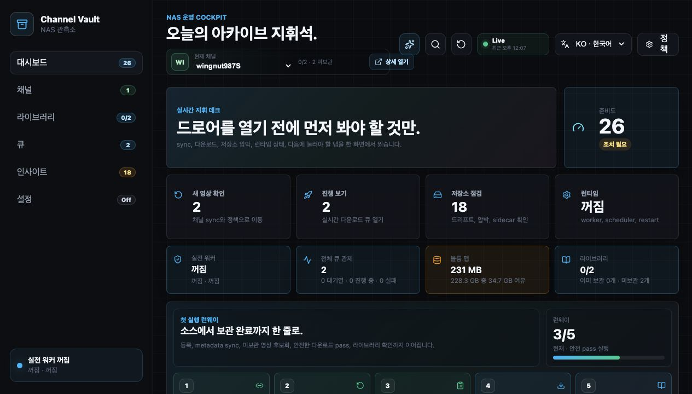
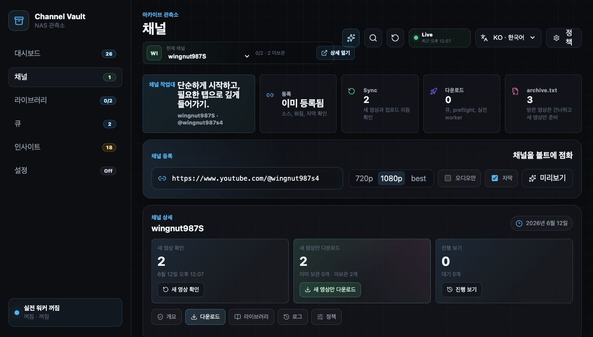
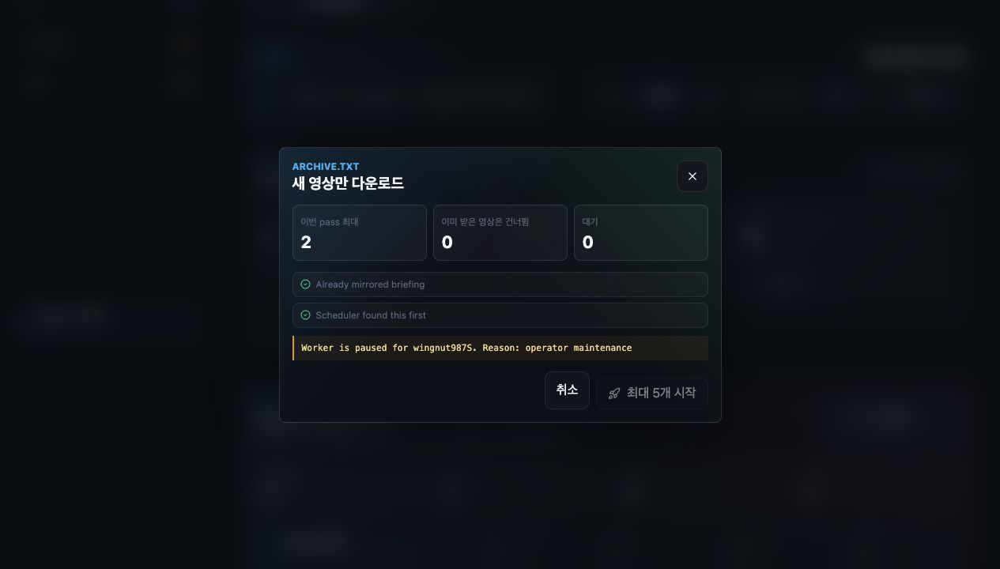
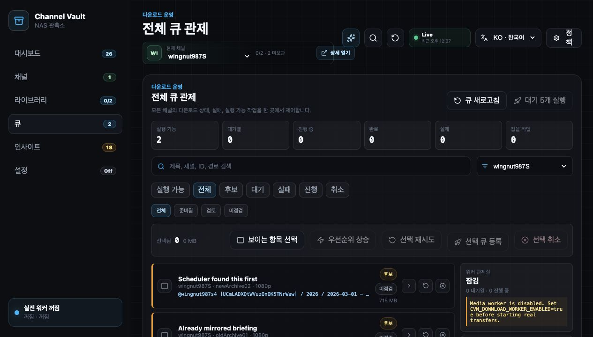
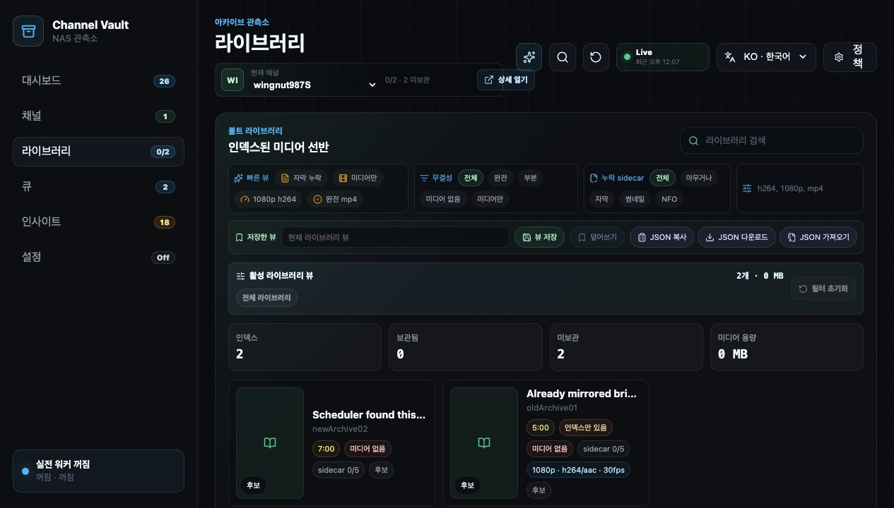

# 첫 백업 마법사

비어 있는 워크스페이스에서 검증된 아카이브까지 이어지는 클릭 단위 안내입니다.
[5분 영상 가이드](../index.md#watch-the-5-minute-guide)와 동일한 흐름입니다.

!!! info "샘플 채널"
    스크린샷은 실제 채널 핸들(`https://www.youtube.com/@wingnut987s4`)을
    등록합니다. 본인이 소유한 아무 채널로 바꿔서 진행하세요 — Channel Vault
    NAS는 **내 채널**을 아카이브하기 위한 도구입니다.

---

## 1단계 — 콘솔 열기

**`http://127.0.0.1:5173/`** 을 엽니다. 새로 비어 있는 워크스페이스에서는
대시보드가 **첫 채널 백업** 마법사를 앞세웁니다.

<figure markdown="span">
  { loading=lazy }
  <figcaption>대시보드 — 다섯 단계 아카이브 경로(원본 추가 → 새 영상 확인 → 누락분만 스테이징 → 가드형 패스 실행 → 라이브러리 검증)가 가운데에 표시됩니다.</figcaption>
</figure>

!!! note "무엇을 클릭하나"
    **Start your first channel backup**을 찾으세요. 기본 입력창은 채널 URL,
    `@handle`, 또는 `UC…` 채널 ID를 받습니다.

---

## 2단계 — 채널 붙여넣고 분석

**Channels** 탭으로 이동하거나 첫 실행 마법사를 사용하세요. **Channel
registration**에 채널을 붙여넣고, 품질(`720p` / `1080p` / `best`)을 고르고,
필요하면 **Subtitles** / **Audio only**를 켠 뒤, **Preview**를 눌러 등록 전에
원본을 분석합니다.

<figure markdown="span">
  { loading=lazy }
  <figcaption>Channels 워크벤치 — 등록 입력, 품질/자막 옵션, 그리고 전송 전에 배치(후보, 대기, 예상 용량)를 미리 보여주는 다운로드 플래너.</figcaption>
</figure>

!!! note "무엇을 클릭하나"
    1. 채널 URL / `@handle` / `UC…` ID를 붙여넣습니다.
    2. **1080p**(또는 원하는 품질)를 고르고 **Subtitles**를 켭니다.
    3. **Preview**를 눌러 분석합니다.

---

## 3단계 — 백업 계획 검토

분석은 채널 이름, 영상 수, 예상 용량, 저장 폴더, 첫 미리보기 영상, 안전 참고
사항을 반환합니다. **다운로드 플래너**는 **Ready**, **Candidates**, **Queued**,
이미 **Selected**된 영상이 각각 몇 개인지와 배치 용량 추정치를 보여줍니다.

!!! note "무엇을 확인하나"
    - **이미 아카이브됨 vs 누락** — 이미 아카이브된 영상은 건너뜁니다.
    - **배치 추정치** — 확정 전 총 용량.
    - **저장 폴더** — 미디어가 저장될 위치
      ([파일시스템 규칙](../reference/filesystem.md) 참고).

문제없어 보이면 **Download new only**(또는 마법사의 **Start first backup**)를
누릅니다.

---

## 4단계 — 가드형 패스 확인 { #step-4-confirm-the-guarded-pass }

실제 다운로드는 항상 확인 모달에서 멈춥니다. 모달은 **Max this pass**, **Already
downloaded skipped**, **Queued**를 요약하고, 미디어 워커가 아직 꺼져 있으면
경고합니다.

<figure markdown="span">
  { loading=lazy }
  <figcaption>확인 모달 — 가드형 패스는 한 번에 5개로 제한됩니다. 워커가 꺼져 있으면 “Media worker is disabled. Set CVN_DOWNLOAD_WORKER_ENABLED=true before starting real transfers.”라고 표시됩니다.</figcaption>
</figure>

!!! note "무엇을 클릭하나"
    [실제 다운로드를 켰다면](enable-downloads.md) **Start up to 5**를 눌러
    가드형 패스를 시작합니다. 그렇지 않으면 영상은 후보로 스테이징되어
    대기합니다.

!!! warning "기본은 안전"
    워커가 꺼져 있으면 아무것도 전송되지 않습니다 — 계획은 스테이징되고 큐는
    claim 전에 일시정지됩니다. 이는 의도된 동작입니다.
    [실제 다운로드 켜기](enable-downloads.md) 참고.

---

## 5단계 — 큐 지켜보기

**Queue** 탭을 열어 진행률, 실패, 재시도, 워커 감사 상세를 확인하세요. **Global
queue control**은 모든 채널에 걸친 Ready / Queued / Running / done / Failed /
Claimable 수를 보여줍니다.

<figure markdown="span">
  { loading=lazy }
  <figcaption>큐 — 카운터, 필터, 작업별 카드. 다운로드가 꺼져 있으면 오른쪽 Worker control room이 “locked / paused before claim”으로 표시됩니다.</figcaption>
</figure>

워커가 무장되고 패스를 확인하면 작업이 **Running**으로 이동하고 진행 막대가
100%까지 채워집니다.

---

## 6단계 — 라이브러리 검증

**Library** 탭을 엽니다. 아카이브된 영상과 누락 영상이 디스크의 실제 파일에
대조되어 함께 표시됩니다 — 코덱/프로파일, 썸네일, 자막, 큐 상태, 경로 무결성.

<figure markdown="span">
  { loading=lazy }
  <figcaption>라이브러리 — 아카이브된 영상과 누락 영상을 한 화면에. 디스크를 인식하므로 오래된 DB 행은 파일이 여전히 NAS에 있는 척하지 않고 누락 미디어로 표시됩니다.</figcaption>
</figure>

!!! success "완료"
    채널을 등록하고, 누락분만 스테이징하고, 가드형 패스를 실행하고,
    라이브러리에서 커버리지를 검증했습니다. 다음:
    [인사이트](product-tour.md#insights)를 살펴보고
    [설정](product-tour.md#settings)을 잠그세요.

---

## 선택 — Safe demo로 둘러보기 { #optional-explore-with-the-safe-demo }

**유튜브를 호출하지 않고** 모든 것을 둘러보려면, 대시보드의 보조 **Safe demo and
advanced import options** 패널을 펼쳐 `Signal Lab` 픽스처를 로드하세요. 채널 하나,
아카이브된 항목 하나, 누락 영상 후보, 큐 이력, 스케줄러 틱, 라이브러리 사이드카,
스토리지 드리프트, 고아 사이드카를 시드합니다.

!!! note "데모 안전성"
    데모 경로는 유튜브를 호출하지 **않고** 다운로드를 시작하지 **않습니다**.
    워크스페이스에 이미 실제 등록 채널이 있으면 백엔드가 데모 시드를 거부하여
    실제 아카이브가 픽스처 데이터와 섞이지 않습니다. 데모 배너와 원클릭 제거
    작업으로 격리를 유지합니다.
