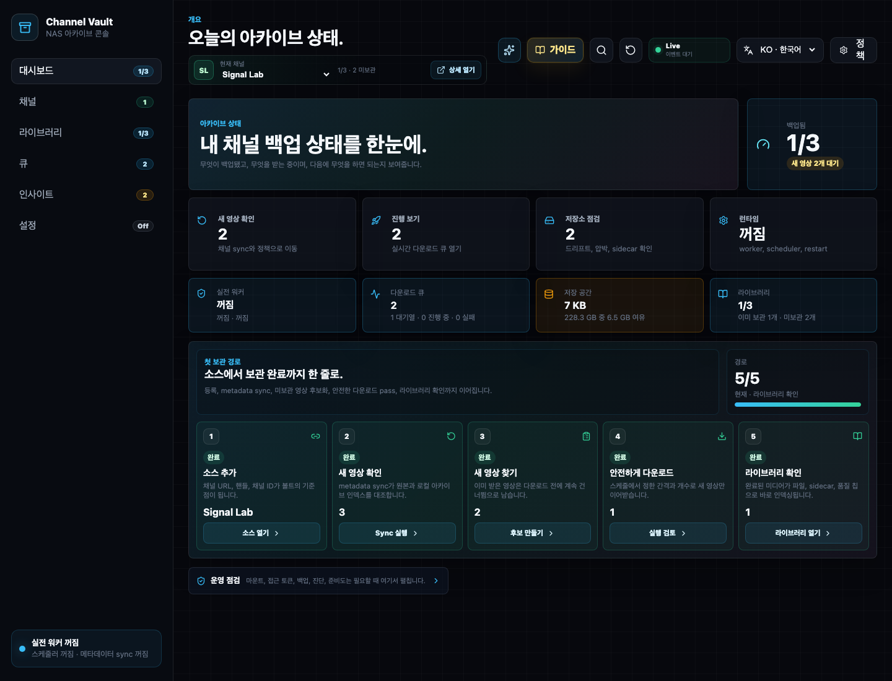
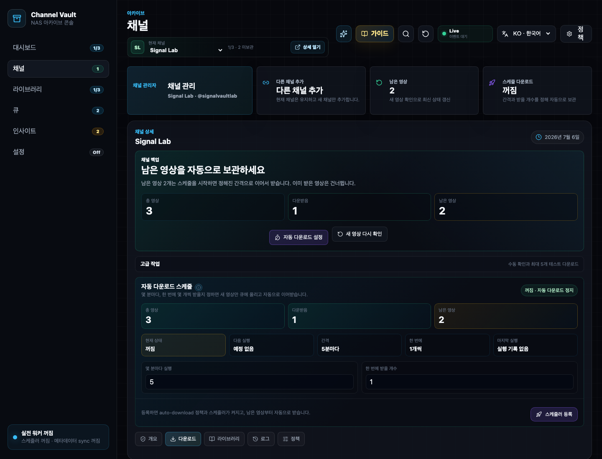
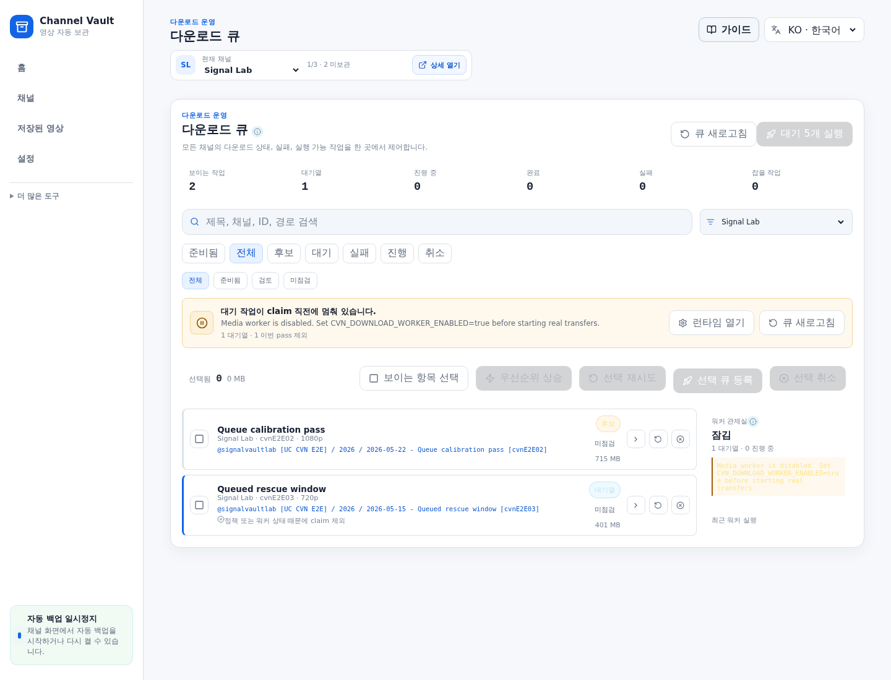
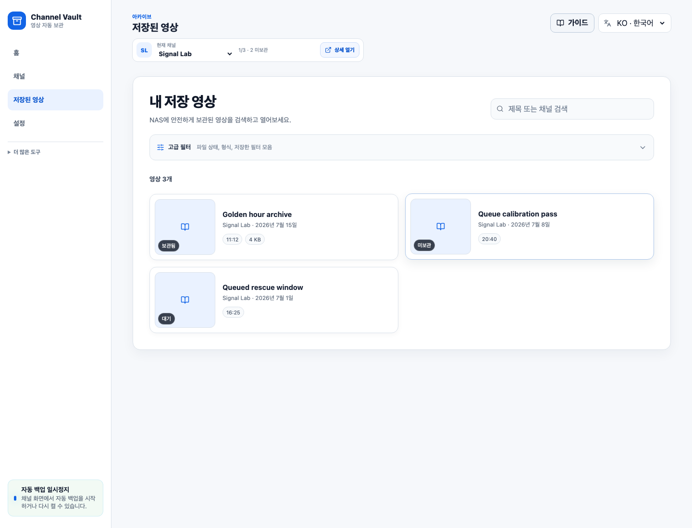

# 채널 백업 시작

비어 있는 워크스페이스에서 검증되고 자동으로 갱신되는 아카이브까지 이어지는 클릭
단위 안내입니다. 채널 등록과 자동 백업이 이제 한 채널 화면에 모여 있습니다.

!!! info "샘플 채널"
    스크린샷은 실제 채널 핸들(`https://www.youtube.com/@wingnut987s4`)을
    등록합니다. 본인이 소유한 아무 채널로 바꿔서 진행하세요 — Channel Vault
    NAS는 **내 채널**을 아카이브하기 위한 도구입니다.

---

## 1단계 — 콘솔 열기

**`http://127.0.0.1:5173/`** 을 열고 **채널**로 이동합니다. 휴대폰에서는 고정된
하단 메뉴, 데스크톱에서는 왼쪽 메뉴에 있습니다.

<figure markdown="span">
  { loading=lazy }
  <figcaption>대시보드 — 아카이브 점수, 다음에 할 유용한 작업, 워커/스토리지/라이브러리 상태를 한눈에. 깊은 제어는 없고, 등록과 보관은 Channels 탭에서 합니다.</figcaption>
</figure>

!!! note "무엇을 클릭하나"
    **채널**을 누른 다음 큰 등록 패널을 사용합니다. 첫 채널을 등록한 뒤에는 현재
    채널 선택기와 **채널 추가** 버튼이 맨 위에 남습니다.

---

## 2단계 — 채널 등록

등록 패널에 채널 URL, `@handle`, 또는 `UC…` 채널 ID를 붙여넣고 **미리보기**를
누릅니다. 채널, 영상 수, 예상 용량, 저장 폴더를 확인한 다음 **채널 등록**을
누릅니다. 품질, 자막, 오디오 전용 설정은 **선택 사항** 안에 있습니다.

<figure markdown="span">
  { loading=lazy }
  <figcaption>채널 — 붙여넣기 → 미리보기 → 채널 등록. 품질과 사이드카 설정은 선택 사항 안에 있습니다.</figcaption>
</figure>

!!! note "무엇을 클릭하나"
    1. 채널 URL / `@handle` / `UC…` ID를 붙여넣습니다.
    2. **미리보기**를 눌러 원본을 확인합니다.
    3. 필요하면 **선택 사항**에서 품질이나 사이드카를 바꿉니다.
    4. **채널 등록**을 눌러 저장합니다. 나중에는 상단 **채널 추가**로
       현재 채널을 유지한 채 채널을 더 등록할 수 있습니다.

---

## 3단계 — 남은 영상 검토

등록한 채널을 엽니다. **“남은 영상 N개를 자동으로 백업합니다”**를
앞세우고, **총 영상**, **다운받음**, **남은 영상** 세 가지 수를 보여줘 얼마나
남았는지 항상 알 수 있습니다.

!!! note "무엇을 확인하나"
    - **총 영상 / 다운받음 / 남은 영상** — 아직 보관이 필요한 영상 수.
    - 언제든 **새 영상 확인**을 눌러 원본과 아카이브 상태를 갱신하세요.

!!! success "이미 모두 보관됐나요?"
    전부 저장됐다면 안내에 **“이 채널은 모두 보관됐습니다”**가 표시됩니다 — 이는
    실패가 아니라 **완료** 상태입니다. 스케줄은 남은 작업이 없을 뿐이며, 채널에 새
    영상이 올라오면 다시 확인하세요.

---

## 4단계 — 자동 백업 시작 { #step-4-start-the-automatic-download-schedule }

이것이 핵심 백업 흐름입니다. 같은 채널 카드에서 다음을 고르세요:

- **다운로드 간격** — 대기 작업을 얼마나 자주 가져올지.
- **한 번에** — 한 번 실행할 때 받을 영상 수(기본 5개).

**자동 백업 시작**을 누릅니다. 실제 다운로드, 메타데이터 동기화, 스케줄러가 한
번에 켜지고 **남은 영상만** 큐에 올라갑니다. 이미 받은 영상은 건너뜁니다. 별도의
워커 시작이나 컨테이너 버튼은 누를 필요가 없습니다.

이후 간격이나 받을 개수를 바꾸려면 값을 수정하고 **설정 저장**을 누릅니다.
**일시 정지**는 이후 실행을 멈춥니다. 모든 영상이 이미 보관됐다면 남은 작업 0은
실패가 아니라 완료이며, 자동 백업을 켜두면 앞으로 올라올 영상도 받습니다.

<figure markdown="span">
  { loading=lazy }
  <figcaption>한 채널 카드 — 총 영상 / 다운받음 / 남은 영상, 자동 백업, 다운로드 간격, 한 번에 받을 개수, 다음 실행, 일시 정지.</figcaption>
</figure>

!!! warning "기본은 안전"
    채널 등록과 미리보기는 아무것도 다운로드하지 않습니다. **자동 백업 시작**(또는
    아래 고급 수동 테스트를 실행)하기 전에는 아무것도 전송되지 않습니다.
    [실제 다운로드 켜기](enable-downloads.md) 참고.

---

## 5단계 — 큐 지켜보기

**Queue** 탭을 열어 진행률, 실패, 재시도, 워커 감사 상세를 확인하세요. 모든 채널의
현재 **보이는 작업**을 보여주며, 이미 보관된 영상의 과거 실패는 숨겨서 실제 현재
작업만 보이게 합니다.

<figure markdown="span">
  { loading=lazy }
  <figcaption>큐 — 카운터, 필터, 작업별 카드와 오른쪽의 Worker control room. 스케줄이 실행 중이면 워커가 “무장됨”으로 표시되고 작업이 Running으로 이동합니다.</figcaption>
</figure>

워커가 무장되면 작업이 **Running**으로 이동하고 진행 막대가 100%까지 채워집니다.

---

## 6단계 — 라이브러리 검증

**Library** 탭을 엽니다. 아카이브된 영상과 누락 영상이 디스크의 실제 파일에
대조되어 함께 표시됩니다 — 코덱/프로파일, 썸네일, 자막, 큐 상태, 경로 무결성.

<figure markdown="span">
  { loading=lazy }
  <figcaption>라이브러리 — 아카이브된 영상과 누락 영상을 한 화면에. 디스크를 인식하므로 오래된 DB 행은 파일이 여전히 NAS에 있는 척하지 않고 누락 미디어로 표시됩니다.</figcaption>
</figure>

!!! success "완료"
    채널을 등록하고, 남은 영상을 검토하고, 아카이브를 최신으로 유지하는 자동
    다운로드 스케줄을 등록했습니다. 다음: [인사이트](product-tour.md#insights)를
    살펴보고 [설정](product-tour.md#settings)을 잠그세요.

---

## 고급 — 수동 1회 테스트 실행 { #advanced-manual-one-pass-test }

**고급 작업**에서 **수동 1회 테스트** — **최대 5개만 바로 실행**을 실행할 수
있습니다. 스케줄과는 별개로 이번 패스에서 설정한 개수만큼 즉시 실행하므로,
스케줄에 맡기기 전에 한 배치를 검증할 때 유용합니다. 실제 전송은 여전히 확인
모달에서 멈춥니다.

!!! note "무엇을 클릭하나"
    **고급 작업 → 수동 1회 테스트**를 열고, 확인 모달(**이번 pass 최대**, **이미
    받은 영상 건너뜀**, **대기**)을 검토한 뒤 확인해 단일 가드형 패스를 실행하세요.
    [실제 다운로드를 켰거나](enable-downloads.md) 여기서 시작할 때만 실행됩니다.

---

## 선택 — Safe demo로 둘러보기 { #optional-explore-with-the-safe-demo }

**유튜브를 호출하지 않고** 모든 것을 둘러보려면, 대시보드의 보조 **Safe demo and
advanced import options** 패널을 펼쳐 `Signal Lab` 픽스처를 로드하세요. 채널 하나,
아카이브된 항목 하나, 누락 영상 후보, 큐 이력, 스케줄러 틱, 라이브러리 사이드카,
스토리지 드리프트, 고아 사이드카를 시드합니다.

!!! note "데모 안전성"
    데모 경로는 유튜브를 호출하지 **않고** 다운로드를 시작하지 **않습니다**.
    워크스페이스에 이미 실제 등록 채널이 있으면 백엔드가 데모 시드를 거부하여
    실제 아카이브가 픽스처 데이터와 섞이지 않습니다. 데모 배너와 원클릭 제거
    작업으로 격리를 유지합니다.
