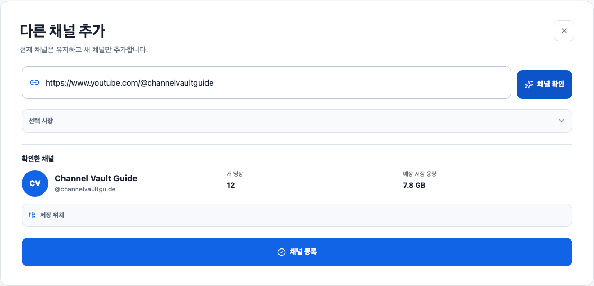
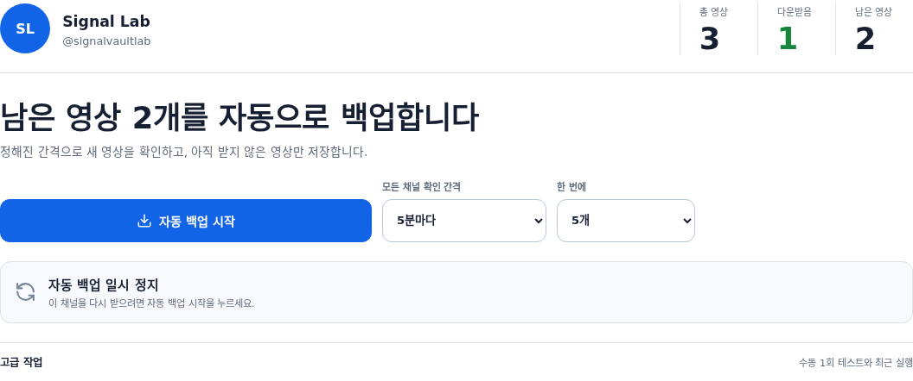
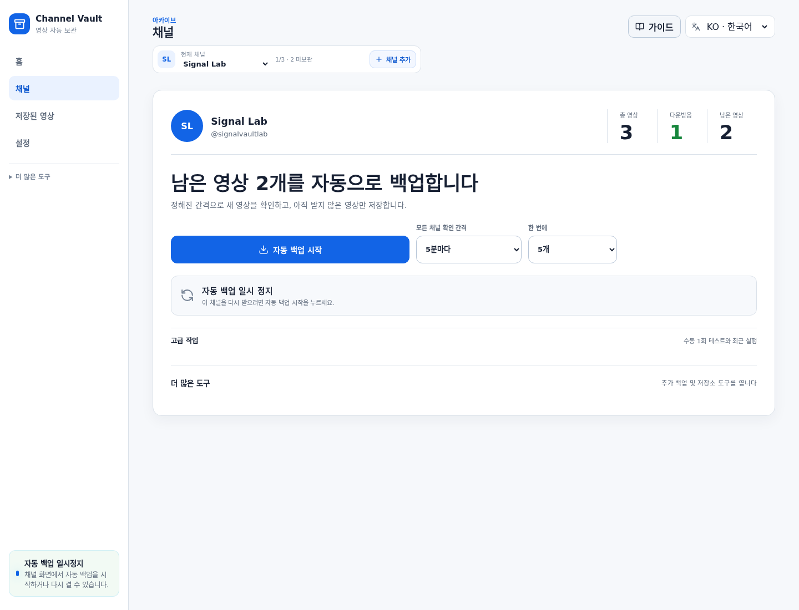

# 첫 채널 백업 시작

채널을 등록하고, 실행 주기를 고르고, 백업 상태를 읽는 세 단계만 따라 하면 됩니다.

!!! info "시작하기 전에"
    컴퓨터 브라우저에서 설치할 때 정한 NAS 주소와 웹 포트를 사용해
    **`http://<NAS-IP>:<web-port>/`** 를 엽니다. **`http://127.0.0.1:5173/`** 은
    프런트엔드를 로컬 개발할 때만 사용합니다. 스크린샷에서는 고정 예제인
    `Channel Vault Guide`와 `https://www.youtube.com/@channelvaultguide`를
    사용하지만, 본인이 소유한 채널로 바꿔서 진행하세요. Channel Vault NAS는
    **내 채널**을 보관하기 위한 도구입니다.

---

## 1단계 — 채널 등록

**홈**에서는 **채널 등록**을 누릅니다. 이미 **채널** 화면에서 다른 채널을 보고
있다면 오른쪽 위 **채널 추가**를 누릅니다.

1. 채널 URL, `@handle`, 또는 `UC…` 채널 ID를 붙여넣습니다.
2. **채널 확인**을 누릅니다.
3. 채널 이름과 원본이 맞는지 확인합니다.
4. **채널 등록**을 누릅니다.

<figure markdown="span">
  { loading=lazy }
  <figcaption>채널 주소를 붙여넣고 채널 확인을 누른 뒤, 결과를 확인하고 채널 등록을 누릅니다.</figcaption>
</figure>

!!! tip "아직 다운로드하지 않습니다"
    채널 확인과 등록은 채널 정보만 저장합니다. 실제 파일 전송은 2단계에서
    **자동 백업 시작**을 누른 뒤 시작됩니다.

---

## 2단계 — 자동 백업 시작 { #start-automatic-backup }

채널을 등록하면 바로 백업 일정이 표시됩니다.

1. **모든 채널 확인 간격**에서 자동 작업을 확인할 주기를 고릅니다.
2. **한 번에**에서 한 차례에 저장할 영상의 최대 개수를 고릅니다.
3. **자동 백업 시작**을 누릅니다.
4. 상태가 **자동 백업 켜짐** 또는 **자동 백업 실행 중**으로 바뀌었는지 확인합니다.

남은 영상이 이미 0개라면 같은 시작 동작이 **새 영상 자동 백업 켜기**로 표시됩니다.
이 버튼을 누르면 앞으로 올라오는 영상을 계속 확인합니다.

<figure markdown="span">
  { loading=lazy }
  <figcaption>모든 채널 확인 간격과 한 번에 받을 개수를 고른 뒤, 자동 백업 시작 버튼 하나를 누릅니다.</figcaption>
</figure>

나중에 두 값을 바꾸고 **설정 저장**을 누르면 됩니다. 새로운 실행을 잠시 멈추려면
**일시 정지**를 누릅니다.

!!! warning "실제 시작 버튼"
    **자동 백업 시작**을 누르면 실제 파일 전송이 시작됩니다. 이 설치에서 다운로드가
    꺼져 있다면 [실제 다운로드 켜기](enable-downloads.md)를 따라 한 뒤 이 버튼으로
    돌아오세요.

---

## 3단계 — 상태 확인

언제든 채널 화면으로 돌아오세요. 다른 화면을 열지 않아도 가장 큰 상태 표시에서
현재 상황을 알 수 있습니다.

| 상태 | 뜻 | 할 일 |
| --- | --- | --- |
| **자동 백업 켜짐** | 다음 예약 확인을 기다리는 중입니다. | 할 일이 없습니다. 다음 실행 시각만 확인하세요. |
| **자동 백업 실행 중** | 지금 영상을 확인하거나 저장하고 있습니다. | 화면을 닫아도 됩니다. 나중에 다시 확인하세요. |
| **자동 백업 일시 정지** | 이 채널은 새로운 예약 실행을 시작하지 않습니다. | 다시 받으려면 **자동 백업 시작**을 누르세요. |
| **확인 필요** | 다운로드가 실패했거나 백업 실행 설정을 확인해야 합니다. | **실패 항목 다시 시도**가 보이면 누릅니다. 그렇지 않으면 **기술 설정 열기**를 누르고 강조된 설정을 확인합니다. |

<figure markdown="span">
  { loading=lazy }
  <figcaption>채널 화면 한곳에서 현재 상태, 저장됨/남음 개수, 다음 확인 시각, 일시 정지를 확인합니다.</figcaption>
</figure>

!!! success "자동 백업 준비 완료"
    남은 영상이 0개가 되면 **이 채널의 영상이 모두 백업되었습니다**라는 제목이
    표시됩니다. 앞으로 올라올 영상도 받으려면 **자동 백업 켜짐** 상태로 두세요.

채널을 더 추가하려면 **채널**을 열고 **채널 추가**를 누른 뒤 같은 세 단계를
반복하세요.

---

## 고급 관리 { #advanced-management }

대부분은 위 세 단계만 알면 됩니다. 문제 해결, 일회성 테스트, 기존 보관 자료 이전,
세부 관리는 [고급 관리](product-tour.md#advanced-management)에서 이어서 확인하세요.
