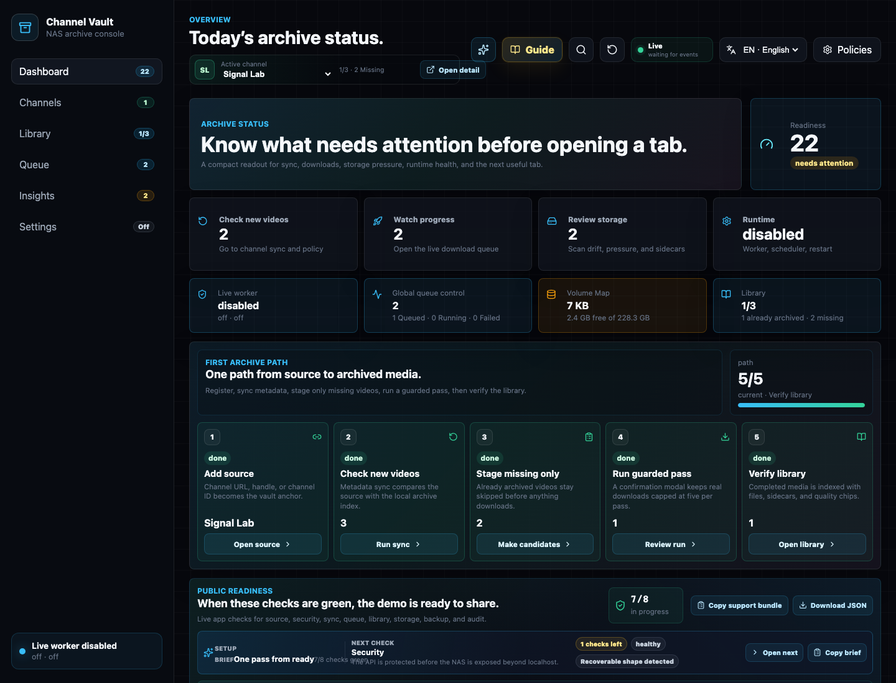
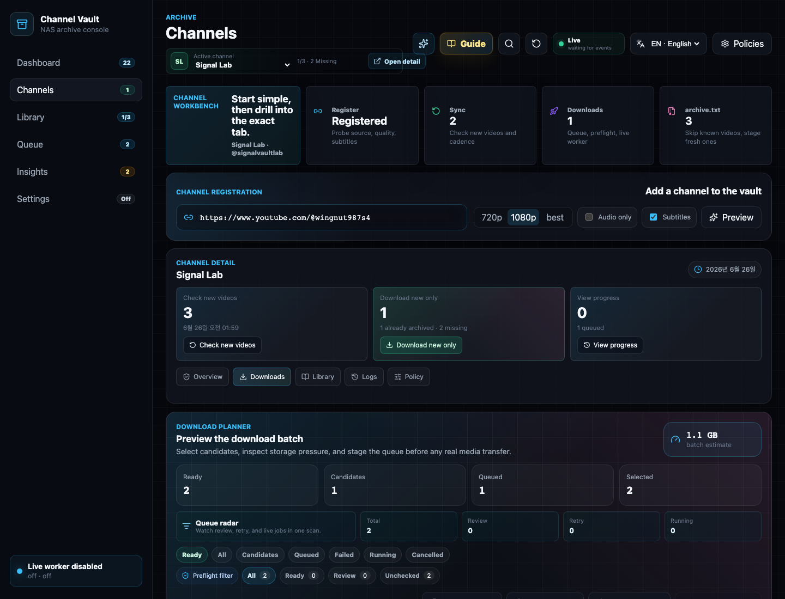
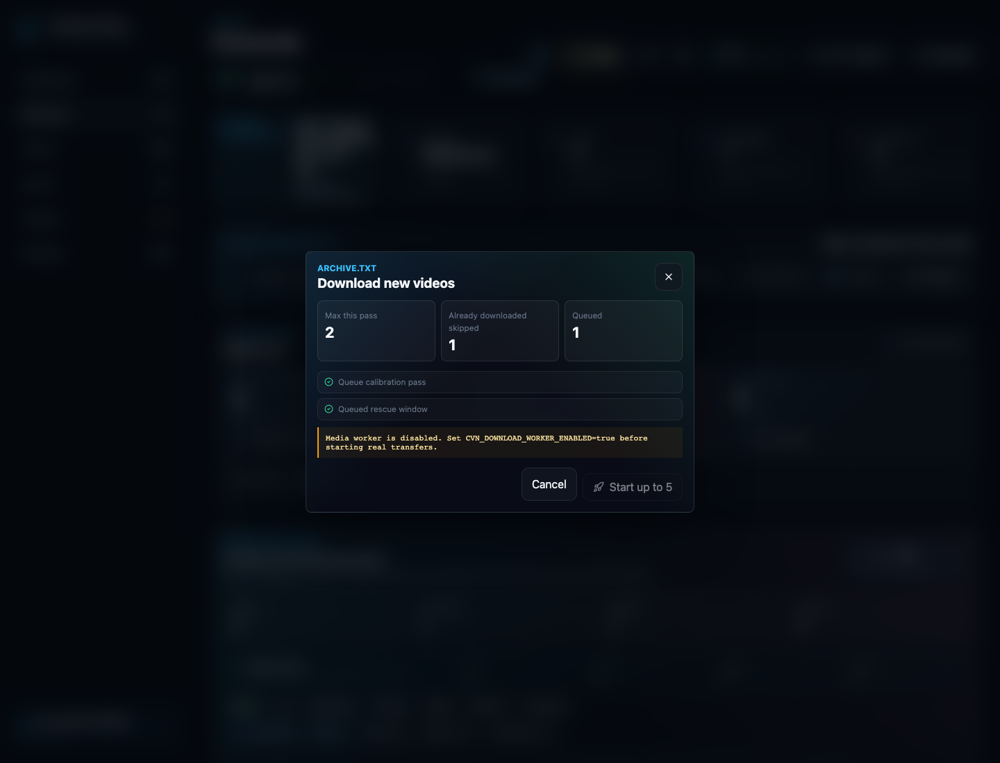
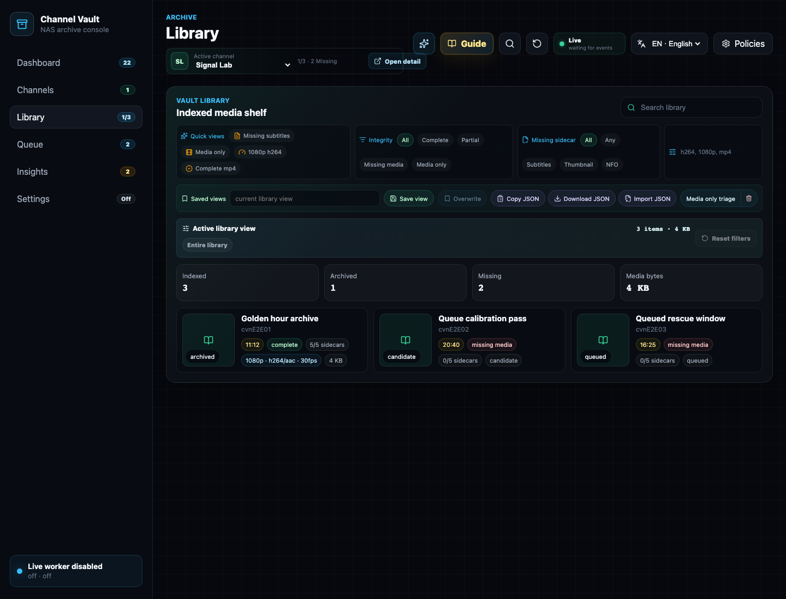

# First backup wizard

This is the click-by-click walkthrough from an empty workspace to a verified
archive. It matches the [5-minute video guide](../index.md#watch-the-5-minute-guide).

!!! info "Sample channel"
    The screenshots register a real channel handle
    (`https://www.youtube.com/@wingnut987s4`). Substitute any channel you own —
    Channel Vault NAS is for archiving **your own** channels.

---

## Step 1 — Open the console

Open **`http://127.0.0.1:5173/`**. On a fresh, empty workspace the Dashboard
leads with the **first channel backup** wizard.

<figure markdown="span">
  { loading=lazy }
  <figcaption>Dashboard — the five-step archive path (Add source → Check new videos → Stage missing only → Run guarded pass → Verify library) is shown across the middle.</figcaption>
</figure>

!!! note "What to click"
    Find **Start your first channel backup**. The primary input accepts a channel
    URL, an `@handle`, or a `UC…` channel ID.

---

## Step 2 — Paste a channel and analyze

Go to the **Channels** tab (or use the first-run wizard). Paste the channel into
**Channel registration**, choose a quality (`720p` / `1080p` / `best`), toggle
**Subtitles** / **Audio only** as needed, then click **Preview** to
analyze the source before anything is registered.

<figure markdown="span">
  { loading=lazy }
  <figcaption>Channels workbench — registration input, quality/subtitle options, and the Download planner that previews the batch (candidates, queued, estimated size) before any transfer.</figcaption>
</figure>

!!! note "What to click"
    1. Paste the channel URL / `@handle` / `UC…` ID.
    2. Pick **1080p** (or your preferred quality) and enable **Subtitles**.
    3. Click **Preview** to analyze.

---

## Step 3 — Review the backup plan

Analysis returns the channel name, video count, estimated size, save folder, first
preview videos, and safety notes. The **Download planner** shows how many videos
are **Ready**, **Candidates**, **Queued**, and already **Selected**, plus a batch
size estimate.

!!! note "What to check"
    - **Already archived vs missing** — already-archived videos are skipped.
    - **Batch estimate** — the total size before you commit.
    - **Save folder** — where media will land (see
      [Filesystem contract](../reference/filesystem.md)).

When it looks right, click **Download new only** (or **Start first backup** from
the wizard).

---

## Step 4 — Confirm the guarded pass

Real downloads always stop at a confirmation modal. It summarizes **Max this
pass**, **Already downloaded skipped**, and **Queued**, and warns if the media
worker is still disabled.

<figure markdown="span">
  { loading=lazy }
  <figcaption>Confirmation modal — a guarded pass is capped at 5 per run. If the worker is off, it says: “Media worker is disabled. Set CVN_DOWNLOAD_WORKER_ENABLED=true before starting real transfers.”</figcaption>
</figure>

!!! note "What to click"
    Click **Start up to 5** to launch a guarded pass — but only if you have
    [enabled real downloads](enable-downloads.md). Otherwise the videos stage as
    candidates and wait.

!!! warning "Safe by default"
    With the worker disabled, nothing is transferred — the plan is staged and the
    queue is paused before claim. This is intentional. See
    [Enable real downloads](enable-downloads.md).

---

## Step 5 — Watch the queue

Open the **Queue** tab to watch progress, failures, retries, and the worker audit
detail. The **Global queue control** shows Ready / Queued / Running / done /
Failed / Claimable counts across every channel.

<figure markdown="span">
  { loading=lazy }
  <figcaption>Queue — counters, filters, and per-job cards. The Worker control room on the right shows the worker state; with downloads off it reads “locked / paused before claim”.</figcaption>
</figure>

Once the worker is armed and you confirm the pass, jobs move to **Running** and
progress bars fill to 100%.

---

## Step 6 — Verify the library

Open the **Library** tab. Archived and missing videos are shown together, indexed
against the real files on disk — codec/profile, thumbnails, subtitles, queue
state, and path integrity.

<figure markdown="span">
  { loading=lazy }
  <figcaption>Library — archived and missing videos in one view, disk-aware so stale DB rows show as missing media instead of pretending the file is still on the NAS.</figcaption>
</figure>

!!! success "Done"
    You've registered a channel, staged only missing videos, run a guarded pass,
    and verified coverage in the Library. Next: explore
    [Insights](product-tour.md#insights) and lock down
    [Settings](product-tour.md#settings).

---

## Optional — explore with the Safe demo

To walk through everything **without calling YouTube**, expand the secondary
**Safe demo and advanced import options** panel on the Dashboard and load the
`Signal Lab` fixture. It seeds a channel, one archived item, missing-video
candidates, queue history, scheduler ticks, library sidecars, storage drift, and
orphan sidecars.

!!! note "Demo safety"
    The demo path does **not** call YouTube and does **not** start downloads. If
    the workspace already has real registered channels, the backend refuses to
    seed the demo so real archives are never mixed with fixture data. A demo
    banner and a one-click removal action keep it isolated.
