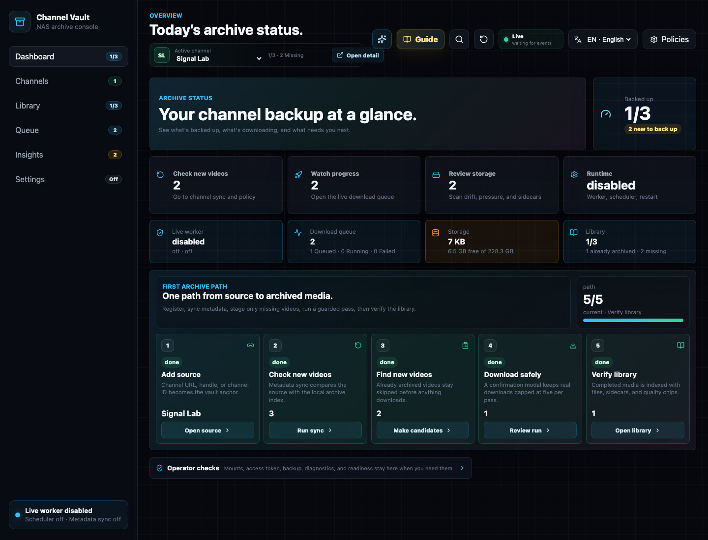
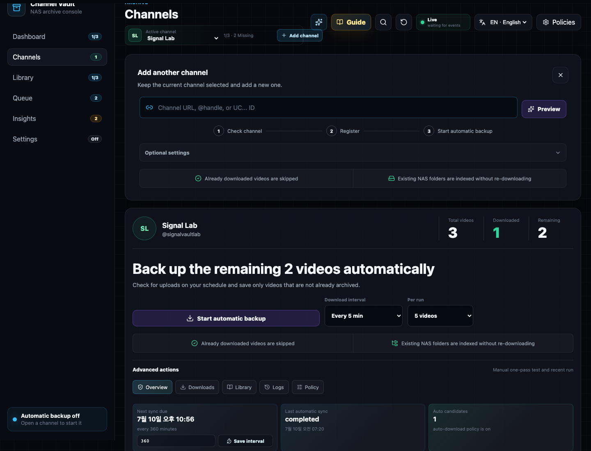

# Start your first channel backup

This is the click-by-click walkthrough from an empty workspace to a verified,
self-updating archive. Registration and automatic backup now stay on one channel
screen.

!!! info "Sample channel"
    The screenshots register a real channel handle
    (`https://www.youtube.com/@wingnut987s4`). Substitute any channel you own —
    Channel Vault NAS is for archiving **your own** channels.

---

## Step 1 — Open the console

Open **`http://127.0.0.1:5173/`**, then open **Channels**. On a phone, Channels is
in the fixed bottom navigation; on desktop it is in the left sidebar.

<figure markdown="span">
  { loading=lazy }
  <figcaption>Dashboard — archive score, the next useful action, and worker / storage / library state at a glance. No deep controls here; the Channels tab is where you register and archive.</figcaption>
</figure>

!!! note "What to click"
    Click **Channels**, then use the large registration panel. The current
    channel selector and **Add channel** button stay at the top after the first
    channel is registered.

---

## Step 2 — Register the channel

In the registration panel, paste the channel URL, an `@handle`, or a `UC…`
channel ID and click **Preview**. Review the channel, video count, estimated
storage, and save folder, then click **Register channel**. Quality, subtitles,
and audio-only are available under **Optional settings**.

<figure markdown="span">
  { loading=lazy }
  <figcaption>Channels — paste → Preview → Register channel, with optional quality and sidecar settings kept out of the main path.</figcaption>
</figure>

!!! note "What to click"
    1. Paste the channel URL / `@handle` / `UC…` ID.
    2. Click **Preview** to inspect the source.
    3. If needed, open **Optional settings** to change quality or sidecars.
    4. Click **Register channel** to save it. Use the top **Add channel** button
       later to register more without losing the current one.

---

## Step 3 — Review the remaining videos

Open the registered channel. It leads with
**"Back up the remaining videos automatically"** and three counts — **Total
videos**, **Downloaded**, and **Remaining** — so you always know how much work
is left.

!!! note "What to check"
    - **Total / Downloaded / Remaining** — how many videos still need archiving.
    - Click **Check for new videos** any time to refresh the source and archive state.

!!! success "Already fully archived?"
    If everything is saved, the guide reads **"This channel is fully archived"**
    — that is a **completed** state, not a failure. The schedule simply has no
    remaining work; check again when the channel publishes new videos.

---

## Step 4 — Start automatic backup { #step-4-start-the-automatic-download-schedule }

This is the main backup flow. On the same channel card, choose:

- **Download interval** — how often queued work is picked up.
- **Per run** — how many videos each pass claims (the default is 5).

Click **Start automatic backup**. This enables real downloads, metadata sync,
and the scheduler in one step, then queues **only the remaining videos**.
Already-downloaded videos are skipped. You do not need to press a separate
worker or container button.

Changed the interval or batch size later? Adjust the fields and click **Save
schedule**. **Pause** stops future passes. When every video is already archived,
the same control can stay on to collect future uploads; zero remaining work is a
completed state, not a failed run.

<figure markdown="span">
  { loading=lazy }
  <figcaption>One channel card — Total / Downloaded / Remaining, automatic backup, download interval, videos per run, next run, and pause.</figcaption>
</figure>

!!! warning "Safe by default"
    Registering the *channel* and previewing never download anything. Nothing
    transfers until you **Start automatic backup** (or run the advanced manual test
    below). See [Enable real downloads](enable-downloads.md).

---

## Step 5 — Watch the queue

Open the **Queue** tab to watch progress, failures, retries, and the worker audit
detail. It shows the current **Visible jobs** across every channel; past failures
for videos that are already archived are hidden so you see only real, current
work.

<figure markdown="span">
  { loading=lazy }
  <figcaption>Queue — counters, filters, and per-job cards, with the Worker control room on the right. When the schedule is running the worker reads “armed” and jobs move to Running.</figcaption>
</figure>

Once the worker is armed, jobs move to **Running** and progress bars fill to 100%.

---

## Step 6 — Verify the library

Open the **Library** tab. Archived and missing videos are shown together, indexed
against the real files on disk — codec/profile, thumbnails, subtitles, queue
state, and path integrity.

<figure markdown="span">
  { loading=lazy }
  <figcaption>Library — archived and missing videos in one view, disk-aware so stale DB rows show as missing media instead of pretending the file is still on the NAS.</figcaption>
</figure>

!!! success "Done"
    You've registered a channel, reviewed the remaining videos, and registered the
    automatic backup that keeps the archive current. Next: explore
    [Insights](product-tour.md#insights) and lock down
    [Settings](product-tour.md#settings).

---

## Advanced — run a manual one-pass test

Under **Advanced actions** you can run a **Manual one-pass test** — **Run up to 5
now only**. It is separate from the schedule: this pass starts up to your
configured batch size immediately, which is handy for verifying one batch before
you rely on the schedule. Real transfers still stop at a confirmation modal.

!!! note "What to click"
    Open **Advanced actions → Manual one-pass test**, review the confirmation
    modal (**Max this pass**, **Already downloaded skipped**, **Queued**), and
    confirm to launch a single guarded pass. It only runs if you have
    [enabled real downloads](enable-downloads.md) or start it from here.

---

## Optional — explore with the Safe demo

To walk through everything **without calling YouTube**, expand the secondary
**Safe demo and advanced import options** panel on the Dashboard and load the
`Signal Lab` fixture. It seeds a channel, one archived item, missing-video
candidates, queue history, scheduler ticks, library sidecars, storage drift, and
orphan sidecars.

!!! note "Demo safety"
    The demo path does **not** call YouTube and does **not** start downloads. If
    the workspace already has real registered channels, the backend refuses to
    seed the demo so real archives are never mixed with fixture data. A demo
    banner and a one-click removal action keep it isolated.
