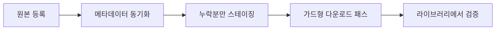

# 사용법

Channel Vault NAS에는 원본에서 검증된 미디어까지 이어지는 하나의 아카이브 경로가
있습니다:

<figure markdown="span">
  { loading=lazy }
  <figcaption>대시보드는 읽기 전용 콕핏입니다: 아카이브 점수, 다음에 할 유용한 작업, 워커/스토리지/라이브러리 상태, 다섯 단계 아카이브 경로.</figcaption>
</figure>

## 여기서 시작하세요

-   :material-play-box:{ .lg .middle } __첫 백업 마법사__

    ---

    클릭 단위 안내: 채널을 붙여넣고, 분석하고, 계획을 검토하고, 확인한 뒤
    큐가 100%에 도달하는 것을 지켜봅니다.

    [:octicons-arrow-right-24: 첫 백업](first-backup.md)

-   :material-download-lock:{ .lg .middle } __실제 다운로드 켜기__

    ---

    앱은 기본적으로 안전합니다. 준비되면 워커를 켜고 가드형 패스를
    확인하세요.

    [:octicons-arrow-right-24: 다운로드 켜기](enable-downloads.md)

-   :material-view-dashboard:{ .lg .middle } __화면 둘러보기__

    ---

    모든 화면에 대한 레퍼런스: 대시보드, 채널, 큐, 라이브러리, 인사이트,
    설정.

    [:octicons-arrow-right-24: 화면 둘러보기](product-tour.md)

-   :material-file-import:{ .lg .middle } __archive.txt 가져오기__

    ---

    이미 `youtube-dl` 장부가 있나요? 가져와서 아직 필요한 영상만
    스테이징하세요.

    [:octicons-arrow-right-24: archive.txt 가져오기](archive-txt.md)

## 내비게이션 지도

| 탭 | 용도 |
| --- | --- |
| **Dashboard** | 아카이브 개요와 다음에 할 유용한 작업. 깊은 제어는 없음. |
| **Channels** | 시작점: 원본 등록/조사, 동기화, 누락분 검토, 다운로드 배치 스테이징. |
| **Queue** | 모든 후보, 대기, 실행 중, 완료, 실패, 취소된 작업. |
| **Library** | 아카이브된 영상과 누락 영상을 코덱/사이드카/경로 무결성과 함께 한 화면에. |
| **Insights** | 실제 아카이브 루트에서 읽은 스토리지 압박, 폴더 구조, 드리프트, 고아 사이드카. |
| **Settings** | 런타임 콘솔: 워커/스케줄러 플래그, 바이너리 경로, 재시작 어댑터, 감사. |

!!! tip "유튜브를 건드리지 않고 체험하기"
    대시보드의 보조 **Safe demo and advanced import options** 패널을 펼쳐
    결정론적 `Signal Lab` 픽스처를 로드하세요 — 외부 호출도, 다운로드도
    없습니다. 첫 둘러보기에 좋습니다.
    [첫 백업 → Safe demo](first-backup.md#optional-explore-with-the-safe-demo)
    참고.
