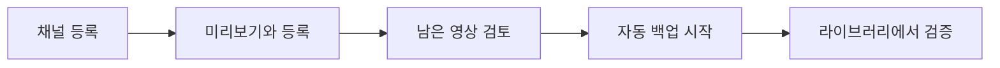

# 사용법

Channel Vault NAS에는 원본에서 검증된 미디어까지 이어지는 하나의 아카이브 경로가
있습니다:

```mermaid
flowchart LR
  A[채널 등록] --> B[미리보기와 등록]
  B --> C[남은 영상 검토]
  C --> D[자동 백업 시작]
  D --> E[라이브러리에서 검증]
```

<figure markdown="span">
  { loading=lazy }
  <figcaption>대시보드는 읽기 전용 개요입니다: 아카이브 점수, 다음에 할 유용한 작업, 워커/스토리지/라이브러리 상태. 깊은 제어는 Channels 탭에 있습니다.</figcaption>
</figure>

## 여기서 시작하세요

-   :material-play-box:{ .lg .middle } __채널 백업 시작__

    ---

    클릭 단위 안내: 채널을 붙여넣고 미리 보고 등록한 뒤, 간격과 한 번에 받을
    개수를 고르고 자동 백업을 시작합니다.

    [:octicons-arrow-right-24: 채널 백업 시작](first-backup.md)

-   :material-download-lock:{ .lg .middle } __실제 다운로드 켜기__

    ---

    앱은 기본적으로 안전합니다. 스케줄을 시작하면 실제 다운로드가 켜지고,
    한 배치만 먼저 확인하고 싶을 때를 위한 고급 수동 1회 테스트가 있습니다.

    [:octicons-arrow-right-24: 다운로드 켜기](enable-downloads.md)

-   :material-view-dashboard:{ .lg .middle } __화면 둘러보기__

    ---

    모든 화면에 대한 레퍼런스: 대시보드, 채널, 큐, 라이브러리, 인사이트,
    설정.

    [:octicons-arrow-right-24: 화면 둘러보기](product-tour.md)

-   :material-file-import:{ .lg .middle } __archive.txt 가져오기__

    ---

    이미 `youtube-dl` 장부가 있나요? 가져와서 아직 필요한 영상만
    스테이징하세요.

    [:octicons-arrow-right-24: archive.txt 가져오기](archive-txt.md)

-   :material-folder-sync:{ .lg .middle } __기존 아카이브 가져오기__

    ---

    다운로드 전에 NAS 폴더와 `archive.txt`를 대조해서 기존 미디어를 색인하고
    건너뜁니다.

    [:octicons-arrow-right-24: 가져오기 가이드](migrate-existing-archive.md)

## 내비게이션 지도

| 탭 | 용도 |
| --- | --- |
| **Dashboard** | 아카이브 개요와 다음에 할 유용한 작업. 깊은 제어는 없음. |
| **채널** | 시작점: 미리보기 → 채널 등록, 남은 영상 검토, 자동 백업 시작. |
| **Queue** | 모든 후보, 대기, 실행 중, 완료, 실패, 취소된 작업. 이미 보관된 영상의 과거 실패는 현재 작업에서 숨깁니다. |
| **Library** | 아카이브된 영상과 누락 영상을 코덱/사이드카/경로 무결성과 함께 한 화면에. |
| **Insights** | 실제 아카이브 루트에서 읽은 스토리지 압박, 폴더 구조, 드리프트, 고아 사이드카. |
| **Settings** | 런타임 콘솔: 워커/스케줄러 플래그, 바이너리 경로, 재시작 어댑터, 감사. |

!!! tip "유튜브를 건드리지 않고 체험하기"
    대시보드의 보조 **Safe demo and advanced import options** 패널을 펼쳐
    결정론적 `Signal Lab` 픽스처를 로드하세요 — 외부 호출도, 다운로드도
    없습니다. 첫 둘러보기에 좋습니다.
    [채널 백업 시작 → Safe demo](first-backup.md#optional-explore-with-the-safe-demo)
    참고.
