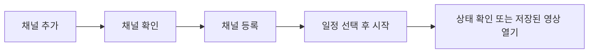
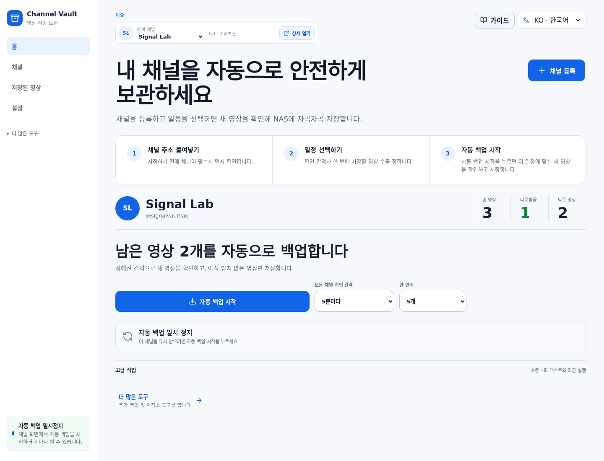

# 사용법

Channel Vault NAS에는 원본에서 검증된 미디어까지 이어지는 하나의 아카이브 경로가
있습니다:

```mermaid
flowchart LR
  A[채널 추가] --> B[채널 확인]
  B --> C[채널 등록]
  C --> D[일정 선택 후 시작]
  D --> E[상태 확인 또는 저장된 영상 열기]
```

<figure markdown="span">
  { loading=lazy }
  <figcaption>홈에는 채널 추가, 자동 백업 시작, 현재 상태 확인이라는 세 가지 일상 작업만 모았습니다.</figcaption>
</figure>

## 여기서 시작하세요

-   :material-play-box:{ .lg .middle } __채널 백업 시작__

    ---

    클릭 단위 안내: 채널을 붙여넣고 확인하고 등록한 뒤, 간격과 한 번에 받을
    개수를 고르고 자동 백업을 시작합니다.

    [:octicons-arrow-right-24: 채널 백업 시작](first-backup.md)

-   :material-download-lock:{ .lg .middle } __실제 다운로드 켜기__

    ---

    앱은 기본적으로 안전합니다. 스케줄을 시작하면 실제 다운로드가 켜지고,
    한 배치만 먼저 확인하고 싶을 때를 위한 고급 수동 1회 테스트가 있습니다.

    [:octicons-arrow-right-24: 다운로드 켜기](enable-downloads.md)

-   :material-view-dashboard:{ .lg .middle } __화면 둘러보기__

    ---

    네 가지 기본 화면과 필요할 때만 여는 고급 관리 화면을 설명합니다.

    [:octicons-arrow-right-24: 화면 둘러보기](product-tour.md)

-   :material-file-import:{ .lg .middle } __archive.txt 가져오기__

    ---

    이미 `youtube-dl` 장부가 있나요? 가져와서 아직 필요한 영상만
    스테이징하세요.

    [:octicons-arrow-right-24: archive.txt 가져오기](archive-txt.md)

-   :material-folder-sync:{ .lg .middle } __기존 아카이브 가져오기__

    ---

    다운로드 전에 NAS 폴더와 `archive.txt`를 대조해서 기존 미디어를 색인하고
    건너뜁니다.

    [:octicons-arrow-right-24: 가져오기 가이드](migrate-existing-archive.md)

## 내비게이션 지도

| 탭 | 용도 |
| --- | --- |
| **홈** | 채널을 추가하고 자동 백업을 시작하거나 멈추며 현재 상태를 확인합니다. |
| **채널** | 선택한 채널을 관리하고 일정을 바꿉니다. |
| **저장된 영상** | NAS에 이미 저장된 영상을 찾습니다. |
| **설정** | 일상 환경설정을 바꾸고, 필요할 때만 기술 설정을 엽니다. |
| **고급 관리** | 문제 해결과 관리를 위한 큐, 저장소 분석, 로그, 정책, 실행 환경 도구입니다. |
