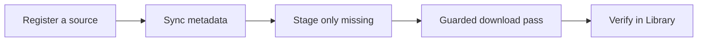

# Usage

Channel Vault NAS has one archive path, from source to verified media:

<figure markdown="span">
  { loading=lazy }
  <figcaption>The Dashboard is a read-only cockpit: archive score, the next useful action, worker/storage/library state, and the five-step archive path.</figcaption>
</figure>

## Start here

-   :material-play-box:{ .lg .middle } __First backup wizard__

    ---

    The click-by-click walkthrough: paste a channel, analyze, review the plan,
    confirm, and watch the queue reach 100%.

    [:octicons-arrow-right-24: First backup](first-backup.md)

-   :material-download-lock:{ .lg .middle } __Enable real downloads__

    ---

    The app is safe by default. Turn on the worker and confirm the guarded pass
    when you're ready for real transfers.

    [:octicons-arrow-right-24: Enable downloads](enable-downloads.md)

-   :material-view-dashboard:{ .lg .middle } __Product tour__

    ---

    Reference for every screen: Dashboard, Channels, Queue, Library, Insights,
    and Settings.

    [:octicons-arrow-right-24: Product tour](product-tour.md)

-   :material-file-import:{ .lg .middle } __archive.txt import__

    ---

    Already have a `youtube-dl` ledger? Import it and stage only the videos you
    still need.

    [:octicons-arrow-right-24: archive.txt import](archive-txt.md)

## The navigation map

| Tab | What it's for |
| --- | --- |
| **Dashboard** | Archive overview and the next useful action. No deep controls. |
| **Channels** | The start point: register/probe a source, sync, review missing, stage the download batch. |
| **Queue** | Every candidate, queued, running, completed, failed, and cancelled job. |
| **Library** | Archived and missing videos together, with codec/sidecar/path integrity. |
| **Insights** | Storage pressure, folder structure, drift, orphan sidecars — read from the real archive root. |
| **Settings** | Runtime console: worker/scheduler flags, binary paths, restart adapters, audit. |

!!! tip "Try it without touching YouTube"
    Expand the secondary **Safe demo and advanced import options** panel on the
    Dashboard to load a deterministic `Signal Lab` fixture — no external calls, no
    downloads. Great for a first look. See
    [First backup → Safe demo](first-backup.md#optional-explore-with-the-safe-demo).
