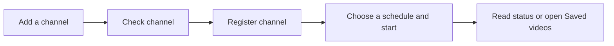

# Usage

Channel Vault NAS has one archive path, from source to verified media:

```mermaid
flowchart LR
  A[Add a channel] --> B[Check channel]
  B --> C[Register channel]
  C --> D[Choose a schedule and start]
  D --> E[Read status or open Saved videos]
```

<figure markdown="span">
  { loading=lazy }
  <figcaption>Home keeps the three everyday tasks together: add a channel, start automatic backup, and read its current status.</figcaption>
</figure>

## Start here

-   :material-play-box:{ .lg .middle } __Channel backup__

    ---

    The click-by-click walkthrough: paste a channel, check it, register it,
    then choose interval and per-run count and start automatic backup.

    [:octicons-arrow-right-24: Start channel backup](first-backup.md)

-   :material-download-lock:{ .lg .middle } __Enable real downloads__

    ---

    The app is safe by default. Starting the schedule enables real downloads;
    an advanced manual one-pass test is there when you want to check a single
    batch first.

    [:octicons-arrow-right-24: Enable downloads](enable-downloads.md)

-   :material-view-dashboard:{ .lg .middle } __Product tour__

    ---

    Reference for the four everyday screens and the advanced management tools.

    [:octicons-arrow-right-24: Product tour](product-tour.md)

-   :material-file-import:{ .lg .middle } __archive.txt import__

    ---

    Already have a `youtube-dl` ledger? Import it and stage only the videos you
    still need.

    [:octicons-arrow-right-24: archive.txt import](archive-txt.md)

-   :material-folder-sync:{ .lg .middle } __Bring an existing archive__

    ---

    Reconcile NAS folders and `archive.txt` before downloading, so existing
    media is indexed and skipped.

    [:octicons-arrow-right-24: Migration guide](migrate-existing-archive.md)

## The navigation map

| Tab | What it's for |
| --- | --- |
| **Home** | Add a channel, start or pause automatic backup, and read the current status. |
| **Channels** | Manage the selected channel and change its schedule. |
| **Saved videos** | Find the videos already stored on the NAS. |
| **Settings** | Change everyday preferences and open technical settings only when needed. |
| **Advanced management** | Queue, storage analysis, logs, policies, and runtime tools for troubleshooting and administration. |
