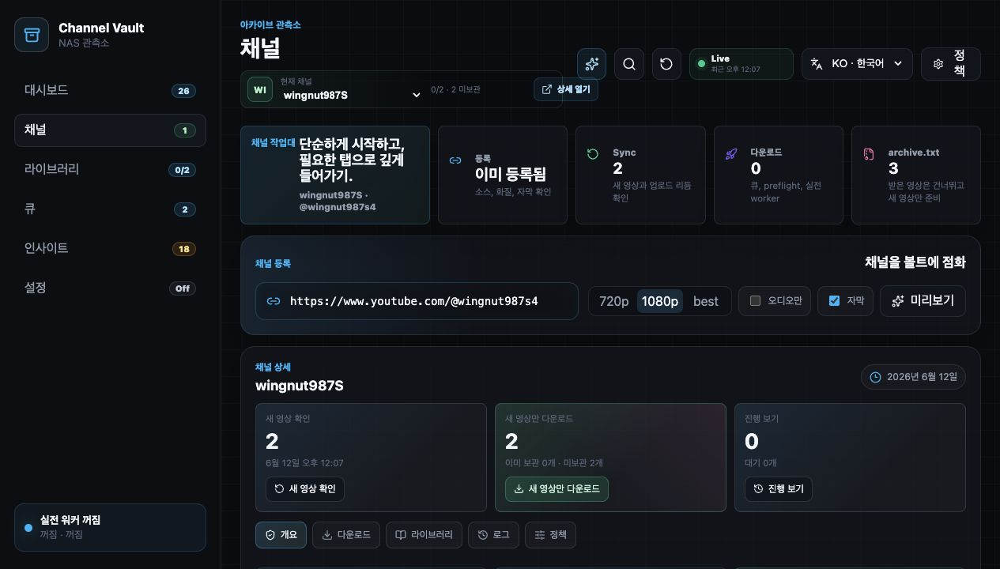
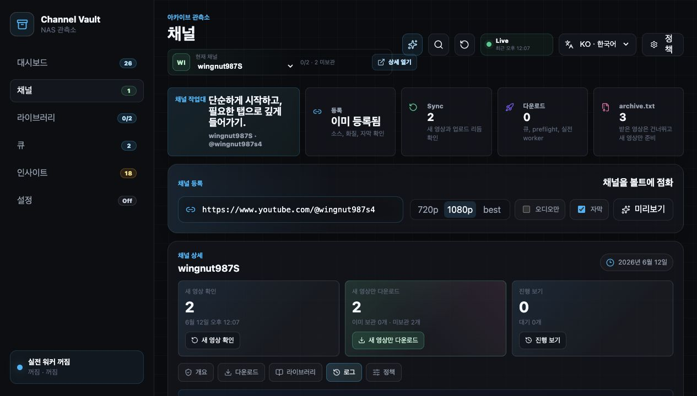
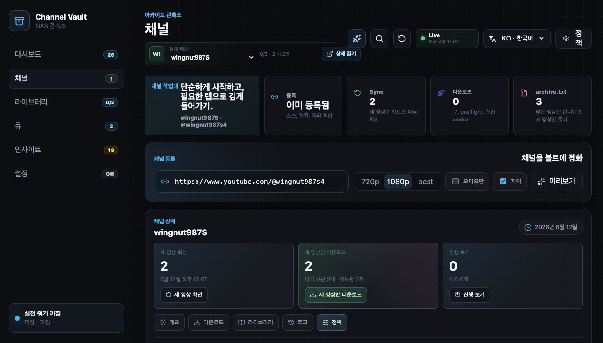
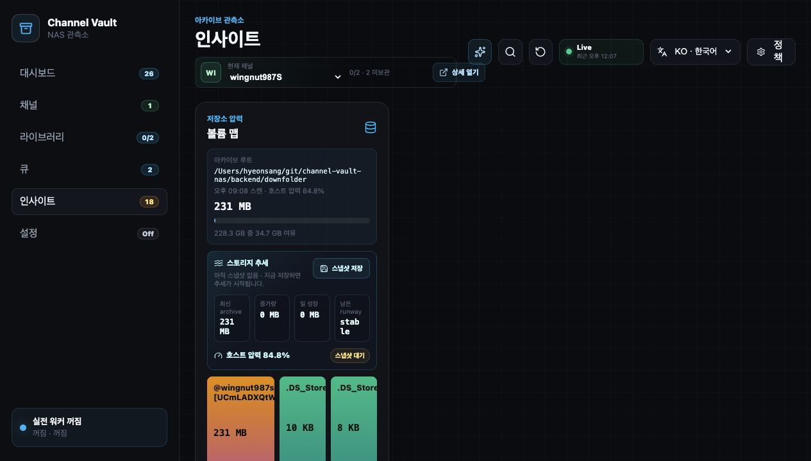
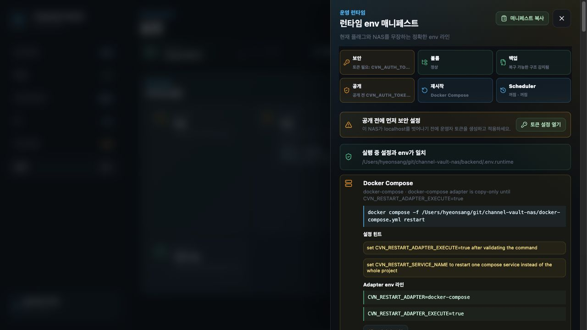
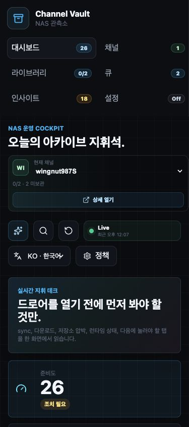

# 화면 둘러보기

모든 화면에 대한 레퍼런스입니다. 안내식 첫 실행은
[첫 백업 마법사](first-backup.md)로 시작하세요.

## Dashboard

아카이브 개요입니다. 현재 아카이브 점수, 다음에 할 유용한 작업, 워커 / 스케줄러 /
스토리지 / 라이브러리 상태, 최근 이벤트, 운영자 작업을 보여줍니다. 깊은 제어는
의도적으로 배제합니다.

<figure markdown="span">
  { loading=lazy }
  <figcaption>대시보드 — “탭을 열기 전에 무엇이 주의를 요하는지 알기”, 그리고 다섯 단계 첫 아카이브 경로와 공개 준비 체크리스트.</figcaption>
</figure>

## Channels

채널 워크벤치가 시작점입니다:

1. 원본을 등록하거나 조사합니다.
2. 메타데이터를 동기화합니다.
3. 누락 영상을 검토합니다.
4. 아카이브되지 않은 것만 큐에 넣고 다운로드합니다.
5. 이미 장부가 있으면 `archive.txt` 가져오기 경로를 사용합니다.

<figure markdown="span">
  { loading=lazy }
  <figcaption>채널 상세 — 개요, 동기화 주기, 채널별 작업(새 영상 확인, 새 것만 다운로드, 진행률 보기).</figcaption>
</figure>

### 채널 로그

모든 동기화, 조사, 워커 작업이 채널별로 기록됩니다.

<figure markdown="span">
  { loading=lazy }
  <figcaption>로그 — 각 채널에 대해 앱이 무엇을 했는지에 대한 감사 가능한 이력.</figcaption>
</figure>

### 채널 정책

채널별 정책은 동기화 주기와 해당 채널의 작업을 워커가 claim할 수 있는지를
제어합니다.

<figure markdown="span">
  { loading=lazy }
  <figcaption>정책 — 후보 생성은 허용하면서 채널의 워커 claim을 일시정지합니다.</figcaption>
</figure>

## Queue

큐 콘솔은 모든 후보, 대기, 실행 중, 완료, 실패, 취소된 작업을 보여줍니다. 실제
다운로드는 확인 흐름과 **워커 패스당 최대 5개 작업**으로 보호됩니다.

<figure markdown="span">
  { loading=lazy }
  <figcaption>큐 — 모든 채널의 다운로드 상태, 실패, claim 가능한 작업을 한 화면에.</figcaption>
</figure>

## Library

라이브러리는 아카이브된 영상과 누락 영상을 함께 보여줍니다. 사이드카, 미디어
파일, 코덱/프로파일 메타데이터, 썸네일, 자막, 큐 상태, 경로 무결성을 색인합니다.
저장된 뷰로 반복적인 NAS 점검을 빠르게 하고, 이식 가능한 JSON 내보내기/가져오기로
유용한 뷰를 설치본 간에 옮깁니다. 미디어 상세 드로어는 범위 지원 파일별 스트림
엔드포인트를 통해 색인된 파일을 앱 안에서 미리 볼 수 있습니다. 아카이브 수는
라이브러리, 채널 상세, 대시보드 커버리지 전반에서 **디스크를 인식**하므로, 오래된
DB 행은 파일이 여전히 NAS에 있는 척하지 않고 누락 미디어로 표시됩니다.

<figure markdown="span">
  { loading=lazy }
  <figcaption>라이브러리 — 아카이브됨 vs 누락을 한 화면에, 코덱/사이드카/품질 칩과 함께.</figcaption>
</figure>

## Insights { #insights }

인사이트는 실제 아카이브 루트를 읽어 스토리지 압박, 폴더 구조, 확장자 총계, 미색인
미디어, 색인됐지만 사라진 파일, 고아 사이드카를 보고합니다.

<figure markdown="span">
  { loading=lazy }
  <figcaption>인사이트 — 볼륨 맵, 스토리지 추세, 채널별 트리맵, 드리프트 대응, 스토리지 트리아지 콘솔.</figcaption>
</figure>

## Settings { #settings }

설정은 런타임 콘솔입니다: 워커 플래그, 스케줄러 플래그, 바이너리 경로, 재시작
어댑터, 틱 로그, 워커 요약, 런타임 감사 이벤트.

<figure markdown="span">
  { loading=lazy }
  <figcaption>Settings → Runtime env manifest — NAS를 무장시키는 정확한 env 줄, 재시작 어댑터 명령, Public access guard.</figcaption>
</figure>

## 모바일

콘솔은 반응형입니다 — 대시보드와 핵심 탭이 빠른 NAS 점검을 위해 휴대폰에서도
동작합니다.

<figure markdown="span">
  { loading=lazy width="360" }
  <figcaption>모바일 대시보드 — 같은 콕핏을 좁은 뷰포트에 맞춘 모습.</figcaption>
</figure>
