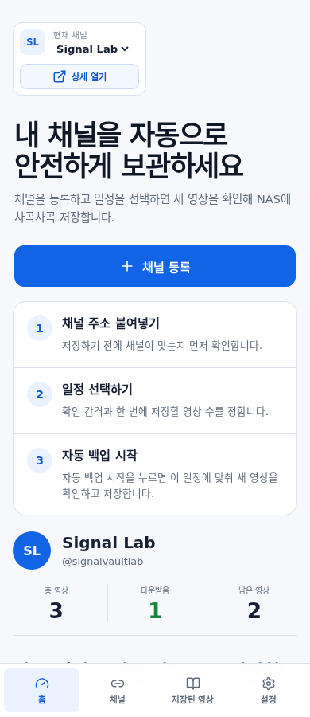
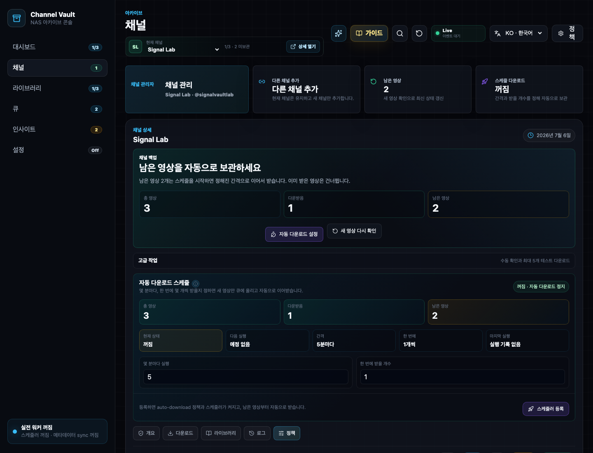
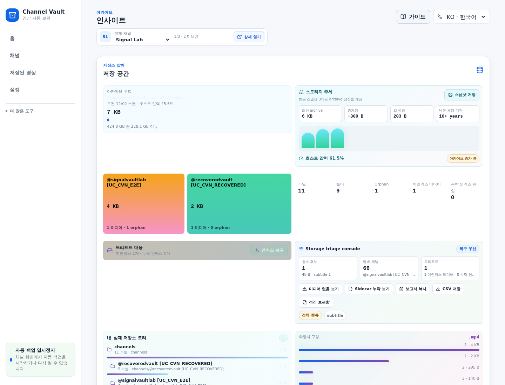
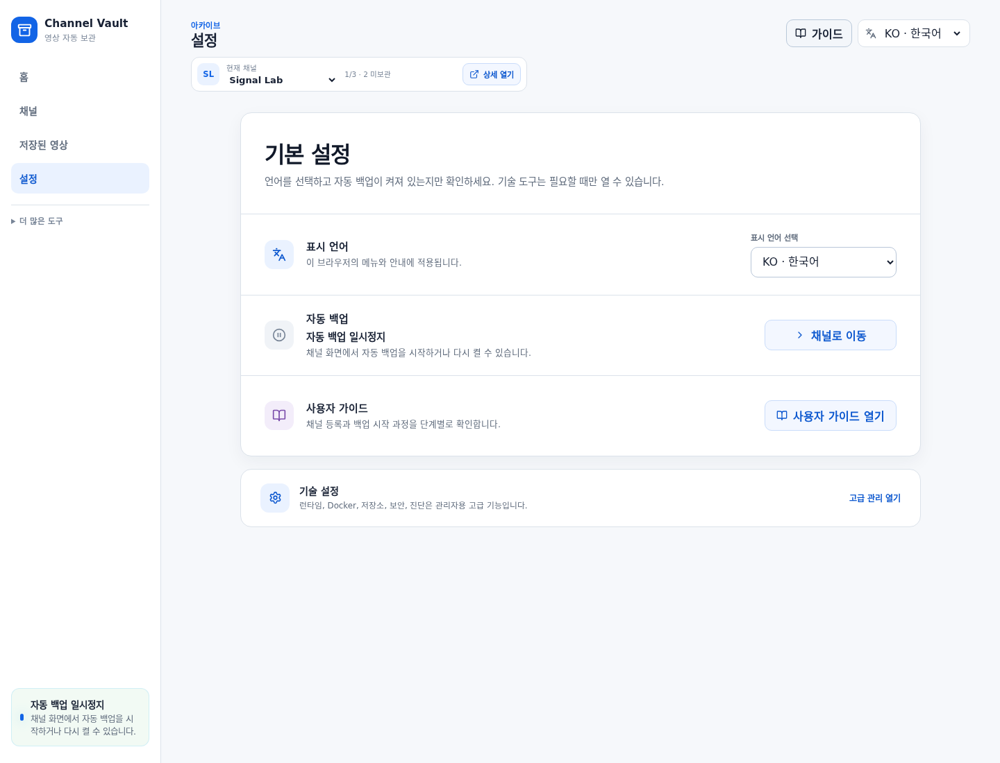

# 화면 둘러보기

Channel Vault는 가벼운 기본 모드로 열립니다. 채널 등록, 자동 백업 시작, 상태 확인이라는
세 가지 일상 작업을 한곳에 모았습니다.

같은 화면을 따라 처음부터 설정하려면 [첫 채널 백업 시작](first-backup.md)을
참고하세요.

## 기본 모드

<figure markdown="span">
  { loading=lazy }
  <figcaption>기본 모드는 선택한 채널, 저장됨/남음 개수, 일정, 지금 필요한 주요 동작을 먼저 보여줍니다.</figcaption>
</figure>

### 1. 채널 등록

1. **홈**에서는 **채널 등록**, **채널** 화면에서는 **채널 추가**를 누릅니다.
2. 채널 URL, `@handle`, 또는 `UC…` 채널 ID를 붙여넣습니다.
3. **채널 확인**을 누릅니다.
4. 채널을 확인한 뒤 **채널 등록**을 누릅니다.

<figure markdown="span">
  { loading=lazy }
  <figcaption>채널 확인 결과에서 원본을 확인한 뒤 채널 등록을 누르면 저장됩니다.</figcaption>
</figure>

채널 확인과 채널 등록만으로는 다운로드가 시작되지 않습니다.

### 2. 자동 백업 시작

1. **모든 채널 확인 간격**을 고릅니다.
2. **한 번에** 받을 개수를 고릅니다.
3. **자동 백업 시작**을 누릅니다.
4. 채널 상태가 **자동 백업 켜짐** 또는 **자동 백업 실행 중**으로 바뀌었는지
   확인합니다.

남은 영상이 0개면 시작 동작이 **새 영상 자동 백업 켜기**로 표시되며, 앞으로
올라오는 영상을 계속 확인합니다.

<figure markdown="span">
  { loading=lazy }
  <figcaption>두 가지 일정 값을 고르고, 자동 백업 시작 버튼 하나를 누릅니다.</figcaption>
</figure>

간격이나 한 번에 받을 개수를 바꾼 뒤에는 **설정 저장**을 누릅니다. 앞으로의 실행을
멈추려면 **일시 정지**를 누릅니다.

### 3. 상태 확인

선택한 채널에는 항상 하나의 주요 상태가 표시됩니다.

| 상태 | 뜻 |
| --- | --- |
| **자동 백업 켜짐** | 다음 예약 확인을 기다리는 중입니다. |
| **자동 백업 실행 중** | 지금 영상을 확인하거나 저장하고 있습니다. |
| **자동 백업 일시 정지** | 이 채널은 새로운 예약 실행을 시작하지 않습니다. |
| **확인 필요** | 결정이나 재시도가 필요한 문제입니다. 안내와 함께 표시된 해결 동작을 누르세요. |

<figure markdown="span">
  { loading=lazy }
  <figcaption>상태, 저장됨/남음 개수, 다음 확인 시각, 현재 동작을 한곳에서 확인합니다.</figcaption>
</figure>

남은 영상이 0개가 되면 **이 채널의 영상이 모두 백업되었습니다**라는 제목이
표시됩니다. 앞으로 올라올 영상도 받으려면 자동 백업을 켜두세요.

## 자주 쓰는 동작

- **채널 더 추가:** **채널**을 열고 **채널 추가**를 누른 뒤 같은 세 단계를 반복합니다.
- **일정 변경:** **모든 채널 확인 간격**이나 **한 번에**를 바꾸고 **설정 저장**을
  누릅니다.
- **이후 자동 다운로드 일시 정지:** 채널에서 **일시 정지**를 누릅니다.
- **보관 파일 보기:** 기본 메뉴에서 **저장된 영상**을 누릅니다.
- **지금 새 영상 확인:** **새 영상 확인**을 누릅니다.

## 모바일

휴대폰에서도 같은 버튼 이름과 순서를 사용합니다. 필수 동작은 아이콘만 있는 메뉴
속으로 숨기지 않습니다.

<figure markdown="span">
  { loading=lazy width="360" }
  <figcaption>모바일에서도 한 열 안에서 채널을 등록하고, 일정을 시작하고, 켜짐·실행 중·일시 정지·확인 필요 상태를 확인합니다.</figcaption>
</figure>

## 고급 관리 { #advanced-management }

대부분은 기본 모드만 알아도 됩니다. 세부 관리나 지원 정보가 필요할 때만 **고급
관리**를 여세요.

### 작업 상세

**큐** 화면은 개별 작업, 필터, 재시도, 상세 진행률을 보여줍니다. **확인 필요**에서
특정 항목을 살펴보라고 안내할 때 사용합니다.

<figure markdown="span">
  { loading=lazy }
  <figcaption>고급 관리 → 큐에서 문제 해결에 필요한 항목별 상세를 확인합니다.</figcaption>
</figure>

### 채널 로그와 정책

**채널**을 누르고 채널을 연 뒤, 채널 화면의 **고급 관리**를 펼쳐 **로그** 또는
**정책**을 선택합니다. 로그에는 채널 작업 이력이 남습니다. 정책은 해당 채널이
작업을 만들고 가져갈 수 있는지 제어합니다. 일반적인 자동 백업 시작과 일시 정지에는
이 화면이 필요하지 않습니다.

<figure markdown="span">
  { loading=lazy }
  <figcaption>채널 → 고급 관리 → 로그에서 선택한 채널의 작업 이력을 확인합니다.</figcaption>
</figure>

<figure markdown="span">
  { loading=lazy }
  <figcaption>채널 → 고급 관리 → 정책에서 채널별 운영 제어를 확인합니다.</figcaption>
</figure>

### 저장된 영상

**저장된 영상**을 누른 뒤 상단 선택기에서 채널을 고릅니다. **제목 또는 채널 검색**에
제목이나 채널 이름 일부를 입력하고 영상 카드를 누르면 파일을 열 수 있습니다. 파일
무결성, sidecar, 코덱, 저장한 뷰, 가져오기/내보내기가 필요할 때만 **고급 필터**를
누르세요. 평소에는 이 기술 기능이 접힌 상태로 유지됩니다.

<figure markdown="span">
  { loading=lazy }
  <figcaption>저장된 영상은 검색과 열 수 있는 파일만 먼저 보여주며, 고급 파일 점검은 접어 둡니다.</figcaption>
</figure>

### 저장소 분석 { #insights }

**인사이트**는 실제 보관 폴더를 읽고 저장 공간 압박, 폴더 구조, 불일치, 색인되지
않은 파일을 분석합니다.

<figure markdown="span">
  { loading=lazy }
  <figcaption>고급 관리 → 인사이트는 NAS 저장소를 자세히 살펴보는 화면입니다.</figcaption>
</figure>

### 설정과 실행 환경 도구 { #settings }

기본 메뉴에서 **설정**을 누르면 일상 설정 화면이 열립니다. 표시 언어를 바꾸고,
자동 백업 상태를 확인하고, 사용자 가이드를 열거나 **채널** 화면으로 돌아갈 수
있습니다. 휴대폰에서도 같은 화면에서 가이드와 고급 관리 경로를 찾을 수 있습니다.

배포하거나 지원 절차를 따를 때만 **기술 설정**을 펼치세요. 여기서 **큐**,
**인사이트**, **런타임 도구**를 열 수 있습니다. 런타임 화면에는 워커/스케줄러
상태, 바이너리 사용 가능 여부, 환경 가이드가 있으며 일반 백업에는 필요하지 않습니다.

<figure markdown="span">
  { loading=lazy }
  <figcaption>설정에서는 언어, 백업 상태, 사용자 가이드를 바로 보고 기술 도구는 접어 둡니다.</figcaption>
</figure>

안전한 일회성 테스트와 이전 방법은
[첫 채널 백업 시작 → 고급 관리](first-backup.md#advanced-management)와
[기존 아카이브 가져오기](migrate-existing-archive.md)를 참고하세요.
