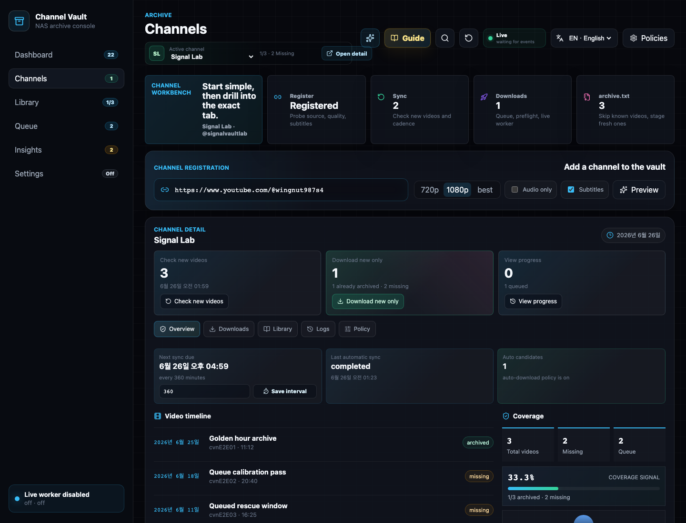
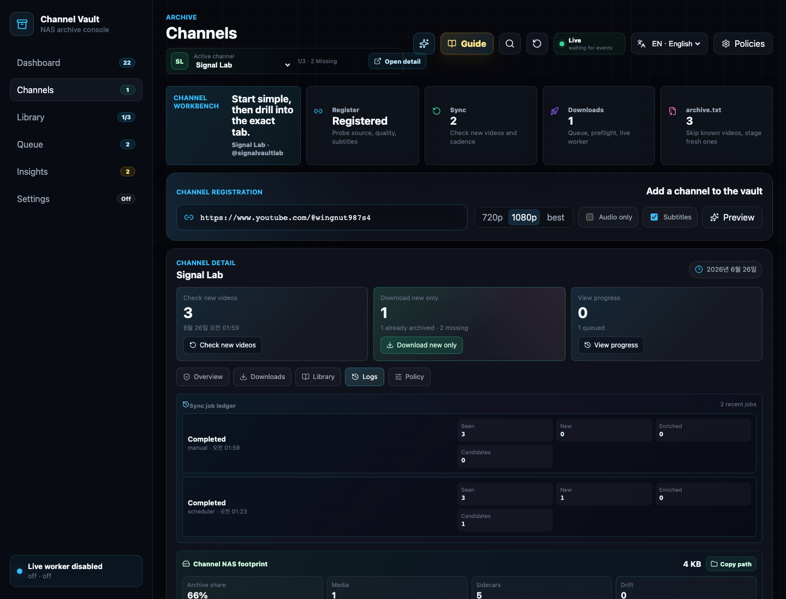
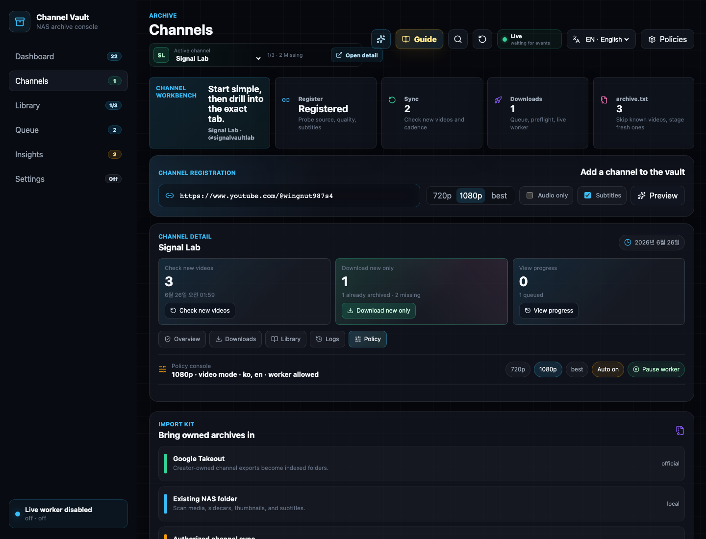
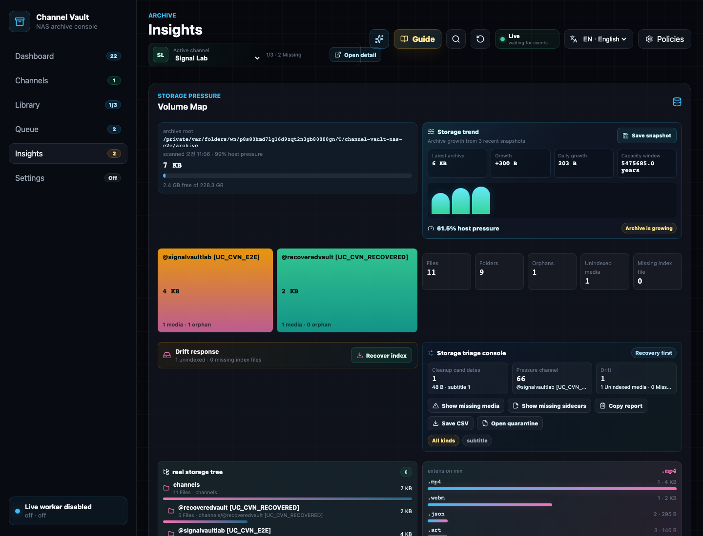
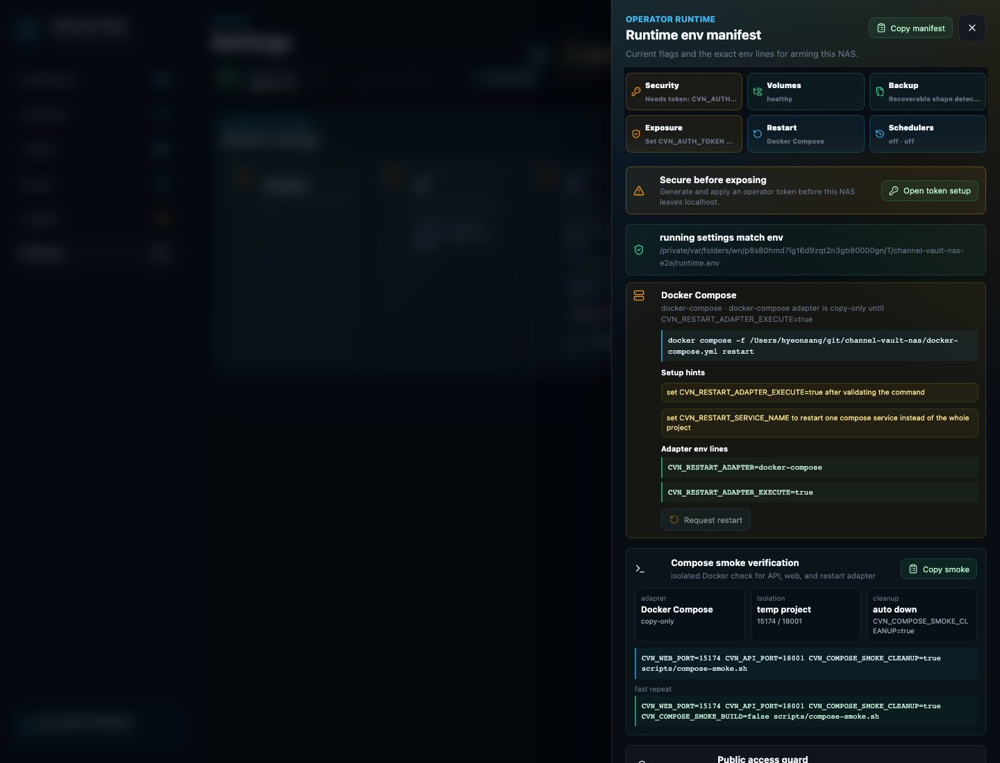
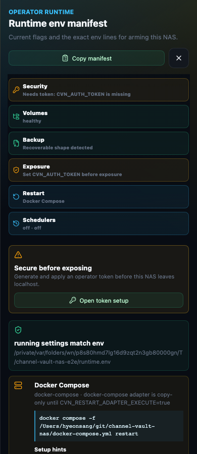

# Product tour

A reference for every screen. For the guided first run, start with the
[First backup wizard](first-backup.md).

## Dashboard

An archive overview. It shows the current archive score, the next useful action,
worker / scheduler / storage / library state, recent events, and operator tasks.
It intentionally avoids deep controls.

<figure markdown="span">
  { loading=lazy }
  <figcaption>Dashboard — “Know what needs attention before opening a tab,” plus the five-step first archive path and the public-readiness checklist.</figcaption>
</figure>

## Channels

The channel workbench is the start point:

1. Register or probe a source.
2. Sync metadata.
3. Review missing videos.
4. Queue/download only what is not archived.
5. Use the `archive.txt` import path when you already have a ledger.

<figure markdown="span">
  { loading=lazy }
  <figcaption>Channel detail — overview, sync cadence, and per-channel actions (Check new videos, Download new only, View progress).</figcaption>
</figure>

### Channel logs

Every sync, probe, and worker action is recorded per channel.

<figure markdown="span">
  { loading=lazy }
  <figcaption>Logs — an auditable history of what the app did for each channel.</figcaption>
</figure>

### Channel policy

Per-channel policy controls sync cadence and whether the worker may claim jobs
for that channel.

<figure markdown="span">
  { loading=lazy }
  <figcaption>Policy — pause worker claims for a channel while still allowing candidate creation.</figcaption>
</figure>

## Queue

The queue console shows all candidate, queued, running, completed, failed, and
cancelled jobs. Real downloads are guarded by a confirmation flow and a maximum of
**5 jobs per worker pass**.

<figure markdown="span">
  { loading=lazy }
  <figcaption>Queue — one screen for every channel’s download state, failures, and claimable work.</figcaption>
</figure>

## Library

The library shows archived and missing videos together. It indexes sidecars,
media files, codec/profile metadata, thumbnails, subtitles, queue state, and path
integrity. Saved views make repeated NAS checks fast, and portable JSON
export/import moves useful views between installs. Media detail drawers can
preview indexed files in-app through range-capable, per-file stream endpoints.
Archive counts are **disk-aware** across Library, Channel detail, and Dashboard
coverage, so stale DB rows show as missing media instead of pretending the file is
still on the NAS.

<figure markdown="span">
  { loading=lazy }
  <figcaption>Library — archived vs missing in one view, with codec/sidecar/quality chips.</figcaption>
</figure>

## Insights

Insights reads the actual archive root and reports storage pressure, folder
structure, extension totals, unindexed media, indexed-but-missing files, and
orphan sidecars.

<figure markdown="span">
  { loading=lazy }
  <figcaption>Insights — Volume Map, storage trend, per-channel treemap, drift response, and the storage triage console.</figcaption>
</figure>

## Settings

Settings is the runtime console: worker flags, scheduler flags, binary paths,
restart adapters, tick logs, worker summaries, and runtime audit events.

<figure markdown="span">
  { loading=lazy }
  <figcaption>Settings → Runtime env manifest — the exact env lines to arm the NAS, restart adapter commands, and the Public access guard.</figcaption>
</figure>

## Mobile

The console is responsive — the Dashboard and core tabs work on a phone for quick
NAS checks.

<figure markdown="span">
  { loading=lazy width="360" }
  <figcaption>Mobile Dashboard — the same cockpit, adapted to a narrow viewport.</figcaption>
</figure>
