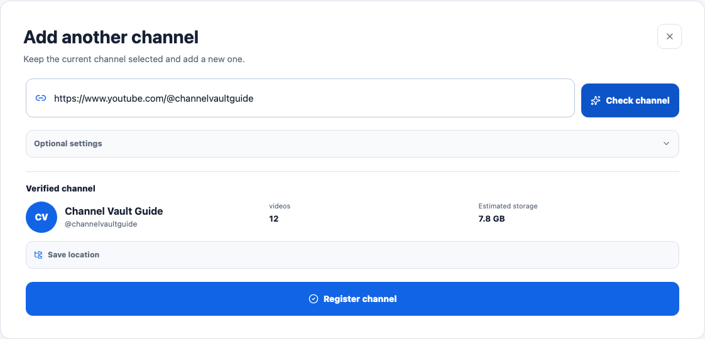
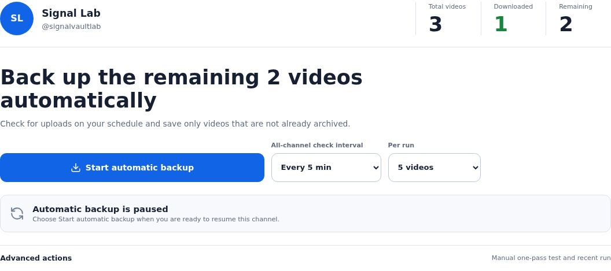
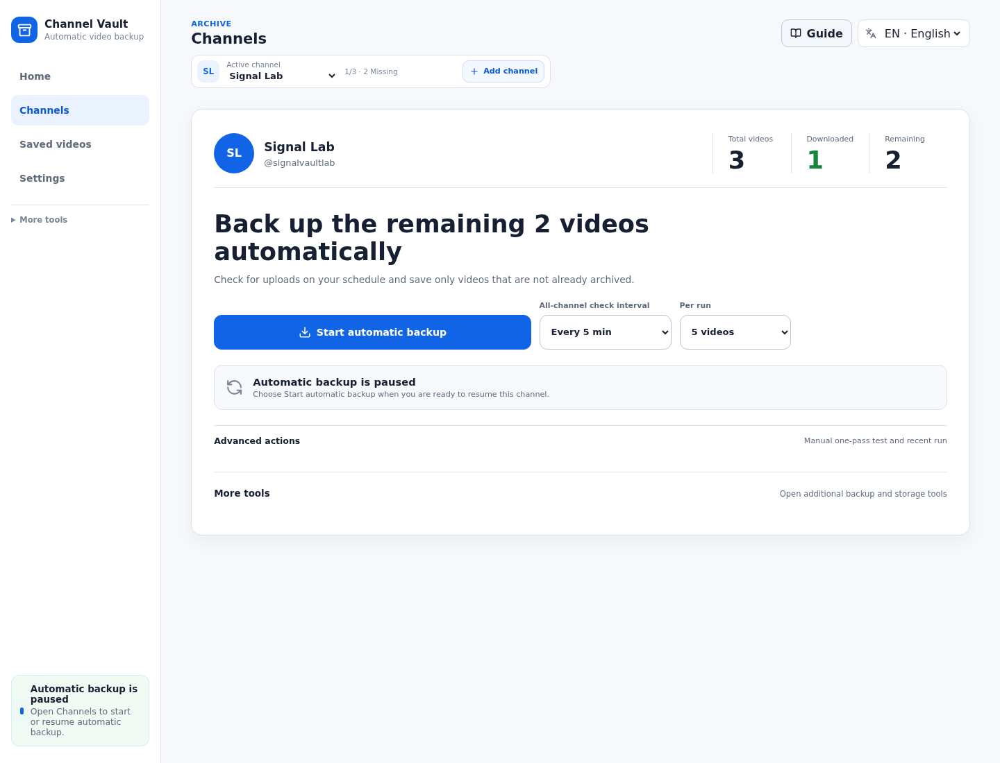
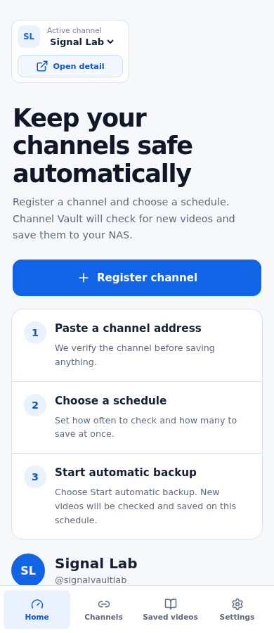
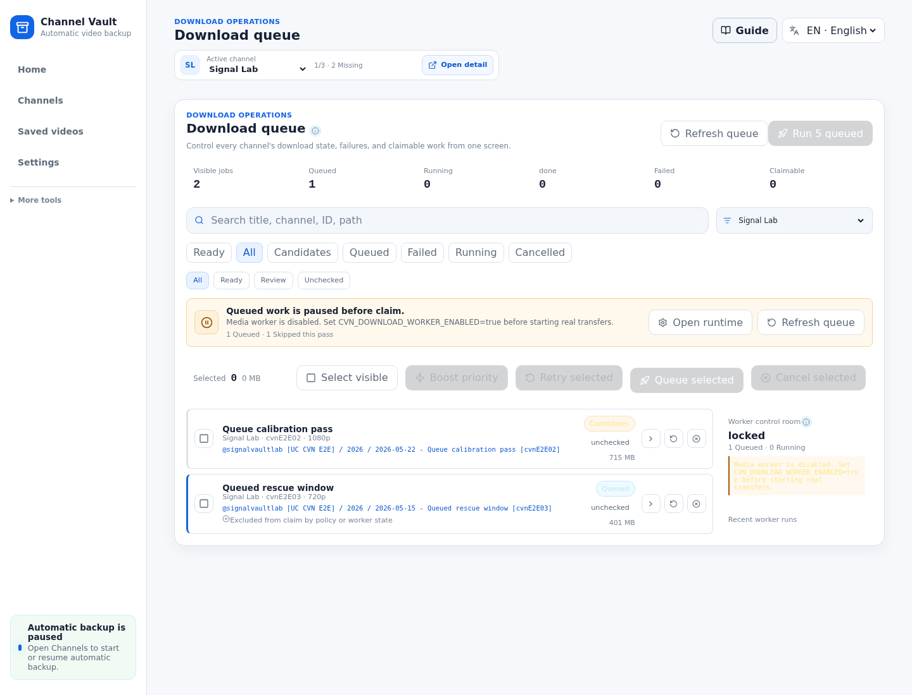
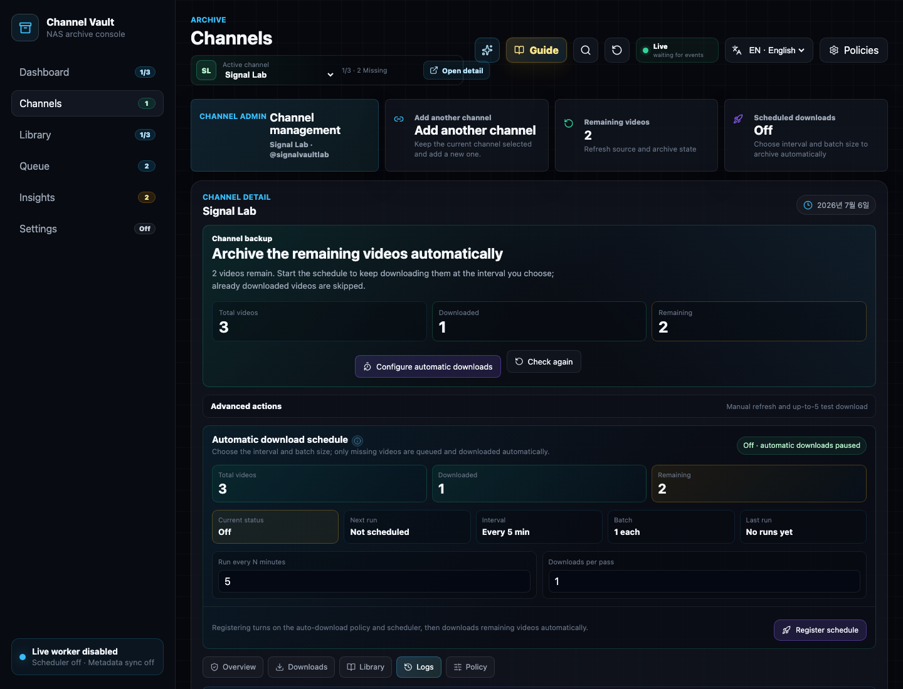
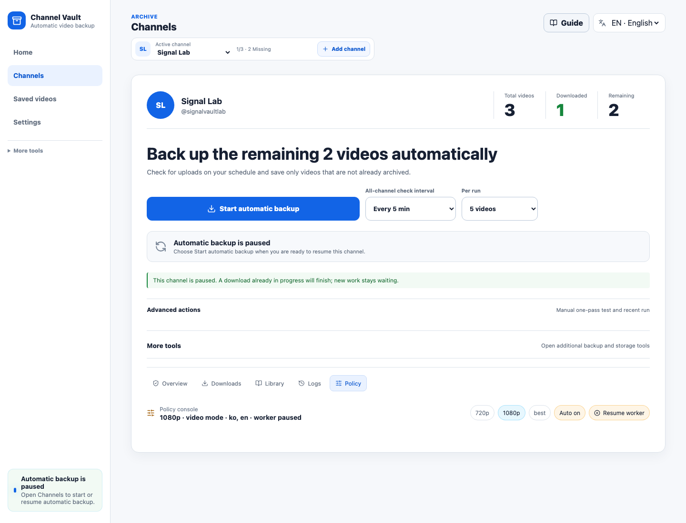
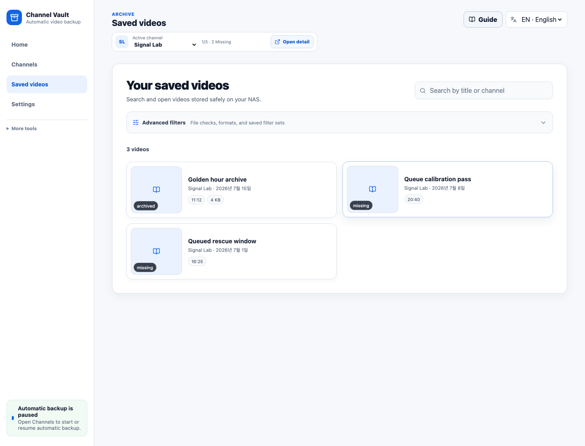
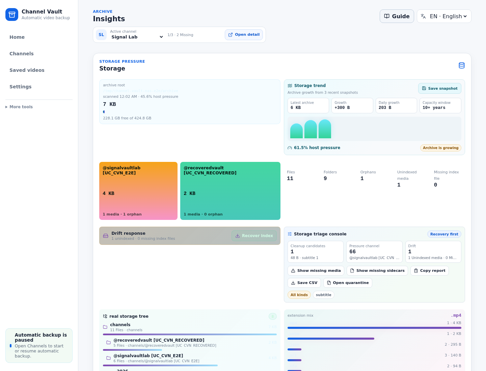
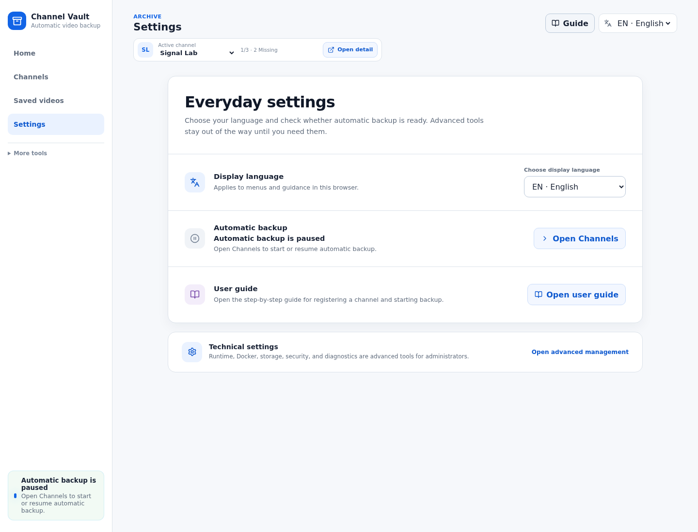

# Product tour

Channel Vault opens in a simple default mode. It keeps the three everyday tasks
together: register a channel, start its automatic backup, and read its status.

For a guided setup with the same controls, see
[Start your first channel backup](first-backup.md).

## Default mode

<figure markdown="span">
  { loading=lazy }
  <figcaption>Default mode leads with the selected channel, saved and remaining counts, its schedule, and one primary action.</figcaption>
</figure>

### 1. Register a channel

1. On **Home**, select **Register channel**. On **Channels**, select **Add channel**.
2. Paste a channel URL, `@handle`, or `UC…` channel ID.
3. Select **Check channel**.
4. Confirm the channel, then select **Register channel**.

<figure markdown="span">
  { loading=lazy }
  <figcaption>Check channel lets you confirm the source before Register channel saves it.</figcaption>
</figure>

Checking and registration do not start a download.

### 2. Start automatic backup

1. Choose **All-channel check interval**.
2. Choose **Per run**.
3. Select **Start automatic backup**.
4. Confirm that the channel changes to **Automatic backup is on** or
   **Automatic backup is running**.

With zero remaining videos, the start action reads **Back up future videos
automatically** and keeps checking for new uploads.

<figure markdown="span">
  { loading=lazy }
  <figcaption>The schedule has two choices and one primary action: Start automatic backup.</figcaption>
</figure>

Select **Save schedule** after changing the interval or per-run count. Select
**Pause** to stop future passes from starting.

### 3. Read the status

The selected channel always shows one main status:

| Status | Meaning |
| --- | --- |
| **Automatic backup is on** | The channel is waiting for its next scheduled check. |
| **Automatic backup is running** | Videos are being checked or saved now. |
| **Automatic backup is paused** | No new scheduled pass will start for this channel. |
| **Needs attention** | A problem needs a decision or retry; follow the action shown with the message. |

<figure markdown="span">
  { loading=lazy }
  <figcaption>Status, saved and remaining counts, next check, and the current action stay together.</figcaption>
</figure>

With zero remaining videos, the heading reads **Every video on this channel is
backed up**. Leave automatic backup on if you want Channel Vault to collect
future uploads.

## Everyday actions

- **Add another channel:** open **Channels**, select **Add channel**, and repeat the three steps.
- **Change the schedule:** change **All-channel check interval** or **Per run**, then
  select **Save schedule**.
- **Pause future download passes:** select **Pause** on the channel.
- **See saved videos:** select **Saved videos** in the main navigation.
- **Refresh a channel now:** select **Check for new videos**.

## Mobile

The default flow uses the same labels and order on a phone. Required actions stay
in the page rather than moving into an icon-only menu.

<figure markdown="span">
  { loading=lazy width="360" }
  <figcaption>On mobile, register the channel, start its schedule, and read the same on, running, paused, or attention status in one column.</figcaption>
</figure>

## Advanced management { #advanced-management }

Most users can stop after the default-mode tour. Open **Advanced management**
only when you need detailed administration or support information.

### Job activity

The **Queue** screen shows individual work items, filters, retries, and detailed
progress. Use it when **Needs attention** asks you to inspect a specific item.

<figure markdown="span">
  { loading=lazy }
  <figcaption>Advanced management → Queue provides per-item detail for troubleshooting.</figcaption>
</figure>

### Channel logs and policy

Select **Channels**, open the channel, expand its **Advanced management**
section, then choose **Logs** or **Policy**. Logs provides an auditable channel
history. Policy controls whether that channel may create and claim work. These
screens are not required to start or pause normal automatic backup.

<figure markdown="span">
  { loading=lazy }
  <figcaption>Channels → Advanced management → Logs records actions for the selected channel.</figcaption>
</figure>

<figure markdown="span">
  { loading=lazy }
  <figcaption>Channels → Advanced management → Policy exposes channel-specific operational controls.</figcaption>
</figure>

### Saved videos

Select **Saved videos**, then choose a channel in the selector at the top. Type
part of a title or channel name into **Search by title or channel**, then click
a video card to open it. For file-integrity, sidecar, codec, saved-view, or
import/export controls, click **Advanced filters**. These technical controls
stay closed during normal browsing.

<figure markdown="span">
  { loading=lazy }
  <figcaption>Saved videos starts with search and the files you can open; advanced file checks stay folded away.</figcaption>
</figure>

### Storage analysis { #insights }

**Insights** reads the archive root and exposes storage pressure, folder
structure, drift, and unindexed-file analysis.

<figure markdown="span">
  { loading=lazy }
  <figcaption>Advanced management → Insights is the detailed NAS storage view.</figcaption>
</figure>

### Settings and runtime tools { #settings }

Select **Settings** in the main navigation for the everyday settings screen.
Here you can change the display language, confirm the automatic-backup state,
open the user guide, or return to **Channels**. On a phone, this is also the
place to reach the same guide and advanced routes.

For deployment or a support procedure, expand **Technical settings**. Then
choose **Queue**, **Insights**, or **Runtime tools**. The runtime panel contains
worker and scheduler state, binary availability, and the environment guide; it
is not required for normal backups.

<figure markdown="span">
  { loading=lazy }
  <figcaption>Settings keeps language, backup status, and the user guide visible while technical tools remain collapsed.</figcaption>
</figure>

For the guarded one-time test and migration paths, see
[Start your first channel backup → Advanced management](first-backup.md#advanced-management)
and [Bring an existing archive](migrate-existing-archive.md).
